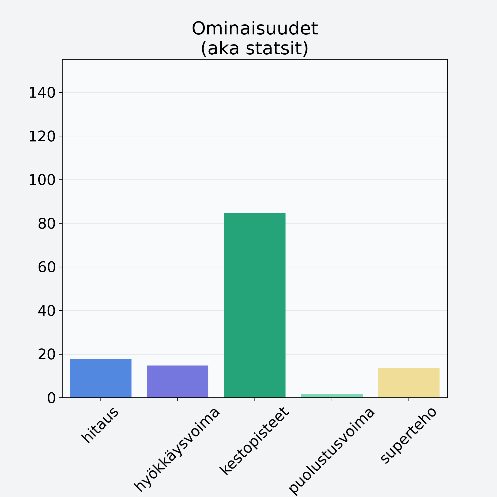

# Granaattiomena, kuorittu

## Kilpailijan tiedot { data-search-exclude }

:octicons-shield-check-24:{ .shieldMarker } Kilpailija on Finelin hyväksymä.

{ loading=lazy }

## Lisätiedot { data-search-exclude }
=== "Statsit numeerisena"

     | Voima          |   Arvo |
     |:---------------|-------:|
     | hitaus         |  17.54 |
     | hyökkäysvoima  |  14.7  |
     | kestopisteet   |  84.51 |
     | puolustusvoima |   1.67 |
     | superteho      |  13.67 |

=== "Samankaltaisia kilpailijoita"
    [Jogurttirusina/jogurttihedelmä, kuorrutettu kuivattu hedelmä](/jogurttirusina-jogurttihedelma-kuorrutettu-kuivattu-hedelma){ .md-button .md-button--primary .similarProduct }
    [Viinirypäle, keskiarvo, punnittu kivineen, vihreä/tumma](/viinirypale-keskiarvo-punnittu-kivineen-vihrea-tumma){ .md-button .md-button--primary .similarProduct }
    [Oliivi, keskiarvo, kivetön, öljyssä, vihreä/musta](/oliivi-keskiarvo-kiveton-oljyssa-vihrea-musta){ .md-button .md-button--primary .similarProduct }

!!! info inline start "Huomio"

    Hyökkäysvoima vaihtelee eri sotureilla :)
