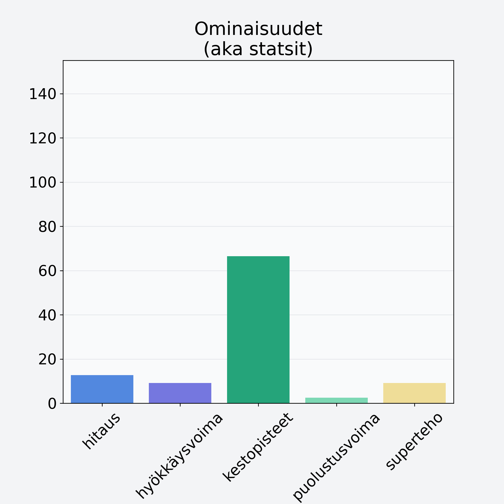

# Guava

## Kilpailijan tiedot { data-search-exclude }

:octicons-shield-check-24:{ .shieldMarker } Kilpailija on Finelin hyväksymä.

{ loading=lazy }

## Lisätiedot { data-search-exclude }
=== "Statsit numeerisena"

     | Voima          |   Arvo |
     |:---------------|-------:|
     | hitaus         |  12.7  |
     | hyökkäysvoima  |   9.2  |
     | kestopisteet   |  66.47 |
     | puolustusvoima |   2.55 |
     | superteho      |   9.2  |

=== "Samankaltaisia kilpailijoita"
    [Ananas, kuorittu](/ananas-kuorittu){ .md-button .md-button--primary .similarProduct }
    [Kiivi, kuorittu](/kiivi-kuorittu){ .md-button .md-button--primary .similarProduct }
    [Mango, kuivattu](/mango-kuivattu){ .md-button .md-button--primary .similarProduct }
    [Vesimeloni, punnittu kuorineen](/vesimeloni-punnittu-kuorineen){ .md-button .md-button--primary .similarProduct }
    [Passionhedelmä](/passionhedelma){ .md-button .md-button--primary .similarProduct }

!!! info inline start "Huomio"

    Hyökkäysvoima vaihtelee eri sotureilla :)
