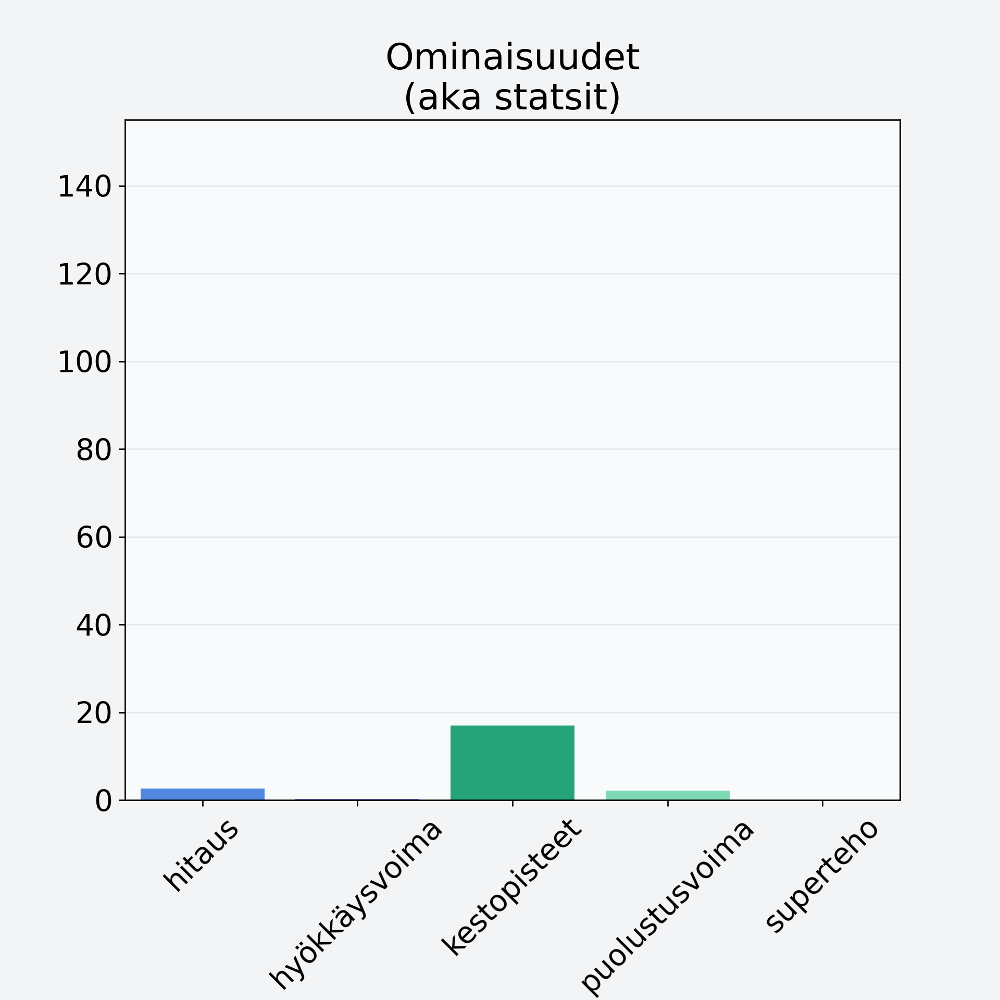

# Herkkusieni, säilyke

## Kilpailijan tiedot { data-search-exclude }

:octicons-shield-check-24:{ .shieldMarker } Kilpailija on Finelin hyväksymä.

{ loading=lazy }

## Lisätiedot { data-search-exclude }
=== "Statsit numeerisena"

     | Voima          |   Arvo |
     |:---------------|-------:|
     | hitaus         |   2.6  |
     | hyökkäysvoima  |   0.2  |
     | kestopisteet   |  16.95 |
     | puolustusvoima |   2.1  |
     | superteho      |   0    |

=== "Samankaltaisia kilpailijoita"
    [Mustatorvisieni, kuivattu](/mustatorvisieni-kuivattu){ .md-button .md-button--primary .similarProduct }
    [Herkkutatti](/herkkutatti){ .md-button .md-button--primary .similarProduct }
    [Herkkusieni](/herkkusieni){ .md-button .md-button--primary .similarProduct }
    [Osterivinokas](/osterivinokas){ .md-button .md-button--primary .similarProduct }

!!! info inline start "Huomio"

    Hyökkäysvoima vaihtelee eri sotureilla :)
