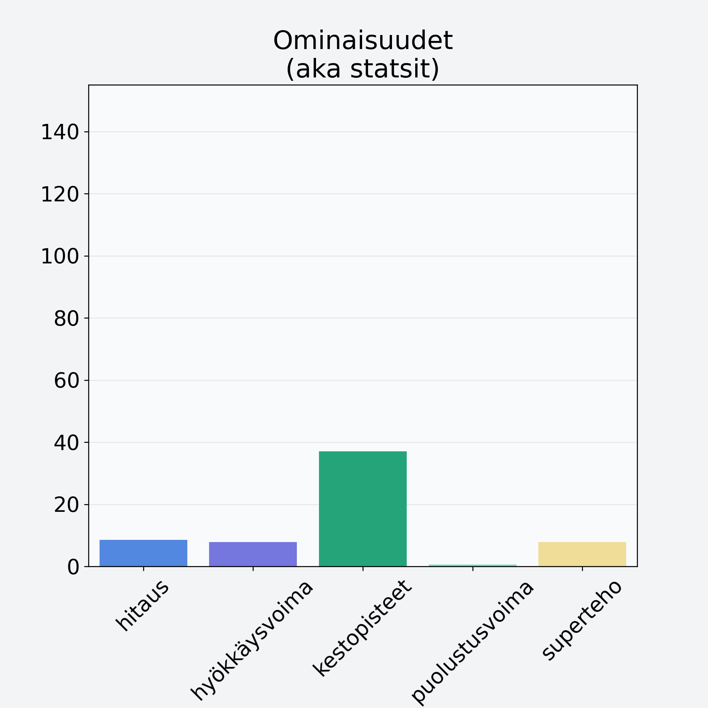

# Hunajameloni, kuorittu

## Kilpailijan tiedot { data-search-exclude }

:octicons-shield-check-24:{ .shieldMarker } Kilpailija on Finelin hyväksymä.

{ loading=lazy }

## Lisätiedot { data-search-exclude }
=== "Statsit numeerisena"

     | Voima          |   Arvo |
     |:---------------|-------:|
     | hitaus         |   8.57 |
     | hyökkäysvoima  |   7.8  |
     | kestopisteet   |  37.02 |
     | puolustusvoima |   0.63 |
     | superteho      |   7.8  |

=== "Samankaltaisia kilpailijoita"
    [Oliivi, keskiarvo, kivetön, öljyssä, vihreä/musta](/oliivi-keskiarvo-kiveton-oljyssa-vihrea-musta){ .md-button .md-button--primary .similarProduct }
    [Granaattiomena, kuorittu](/granaattiomena-kuorittu){ .md-button .md-button--primary .similarProduct }
    [Ananas, kuorittu](/ananas-kuorittu){ .md-button .md-button--primary .similarProduct }

!!! info inline start "Huomio"

    Hyökkäysvoima vaihtelee eri sotureilla :)
