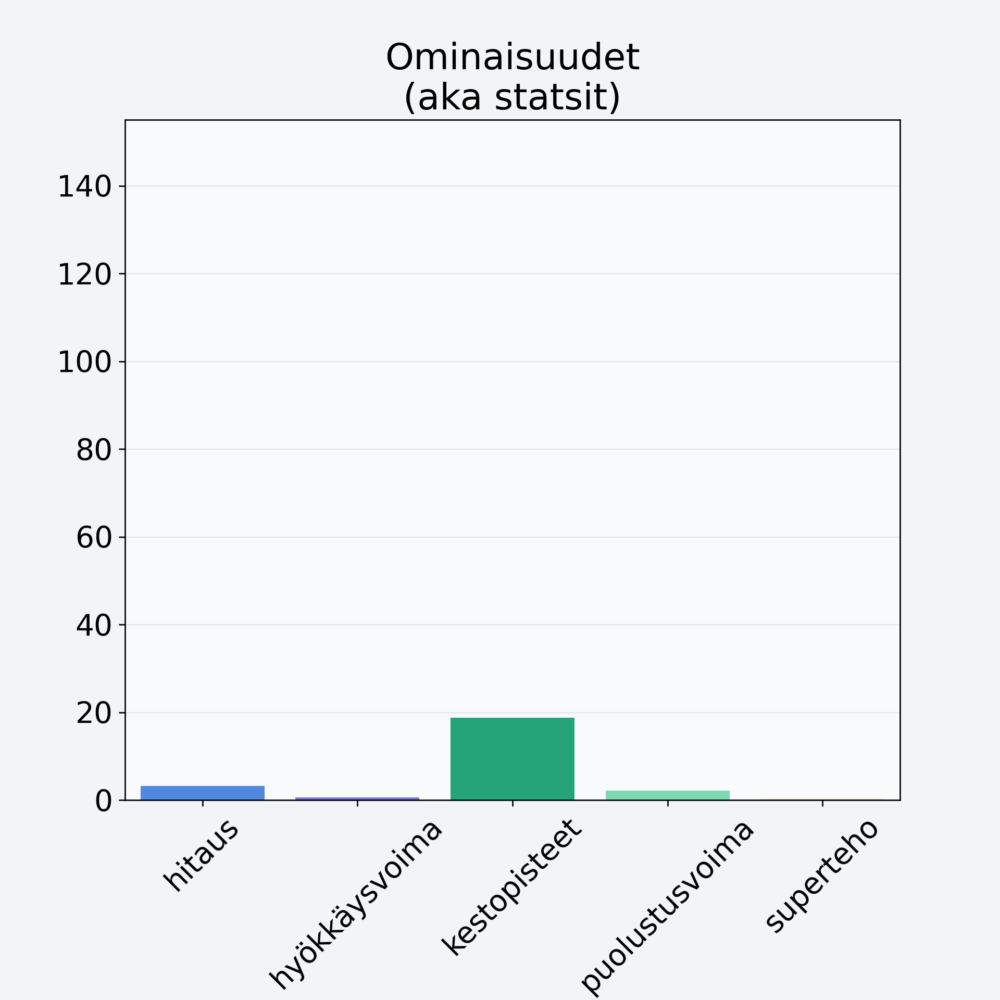

# Kangasrousku

## Kilpailijan tiedot { data-search-exclude }

:octicons-shield-check-24:{ .shieldMarker } Kilpailija on Finelin hyväksymä.

{ loading=lazy }

## Lisätiedot { data-search-exclude }
=== "Statsit numeerisena"

     | Voima          |   Arvo |
     |:---------------|-------:|
     | hitaus         |   3.25 |
     | hyökkäysvoima  |   0.62 |
     | kestopisteet   |  18.8  |
     | puolustusvoima |   2.13 |
     | superteho      |   0.25 |

=== "Samankaltaisia kilpailijoita"
    [Herkkusieni, säilyke](/herkkusieni-sailyke){ .md-button .md-button--primary .similarProduct }
    [Osterivinokas](/osterivinokas){ .md-button .md-button--primary .similarProduct }
    [Suppilovahvero](/suppilovahvero){ .md-button .md-button--primary .similarProduct }
    [Siitakesieni](/siitakesieni){ .md-button .md-button--primary .similarProduct }
    [Männynherkkutatti, pakaste](/mannynherkkutatti-pakaste){ .md-button .md-button--primary .similarProduct }
    [Herkkusieni](/herkkusieni){ .md-button .md-button--primary .similarProduct }

!!! info inline start "Huomio"

    Hyökkäysvoima vaihtelee eri sotureilla :)
