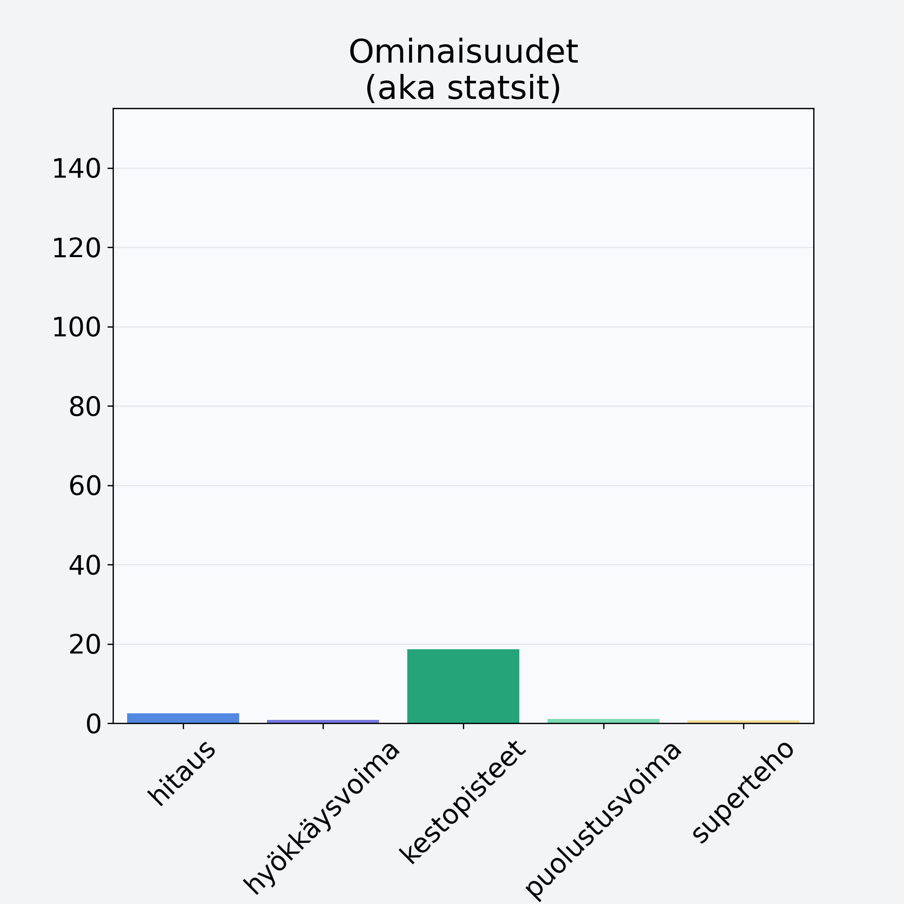

# Kangastatti

## Kilpailijan tiedot { data-search-exclude }

:octicons-shield-check-24:{ .shieldMarker } Kilpailija on Finelin hyväksymä.

{ loading=lazy }

## Lisätiedot { data-search-exclude }
=== "Statsit numeerisena"

     | Voima          |   Arvo |
     |:---------------|-------:|
     | hitaus         |   2.45 |
     | hyökkäysvoima  |   0.81 |
     | kestopisteet   |  18.65 |
     | puolustusvoima |   1.1  |
     | superteho      |   0.66 |

=== "Samankaltaisia kilpailijoita"
    [Korvasieni](/korvasieni){ .md-button .md-button--primary .similarProduct }
    [Kangasrousku](/kangasrousku){ .md-button .md-button--primary .similarProduct }
    [Sieni rouskut, suolattu, käyttövalmis](/sieni-rouskut-suolattu-kayttovalmis){ .md-button .md-button--primary .similarProduct }
    [Herkkutatti](/herkkutatti){ .md-button .md-button--primary .similarProduct }
    [Siitakesieni](/siitakesieni){ .md-button .md-button--primary .similarProduct }
    [Lampaankääpä](/lampaankaapa){ .md-button .md-button--primary .similarProduct }

!!! info inline start "Huomio"

    Hyökkäysvoima vaihtelee eri sotureilla :)
