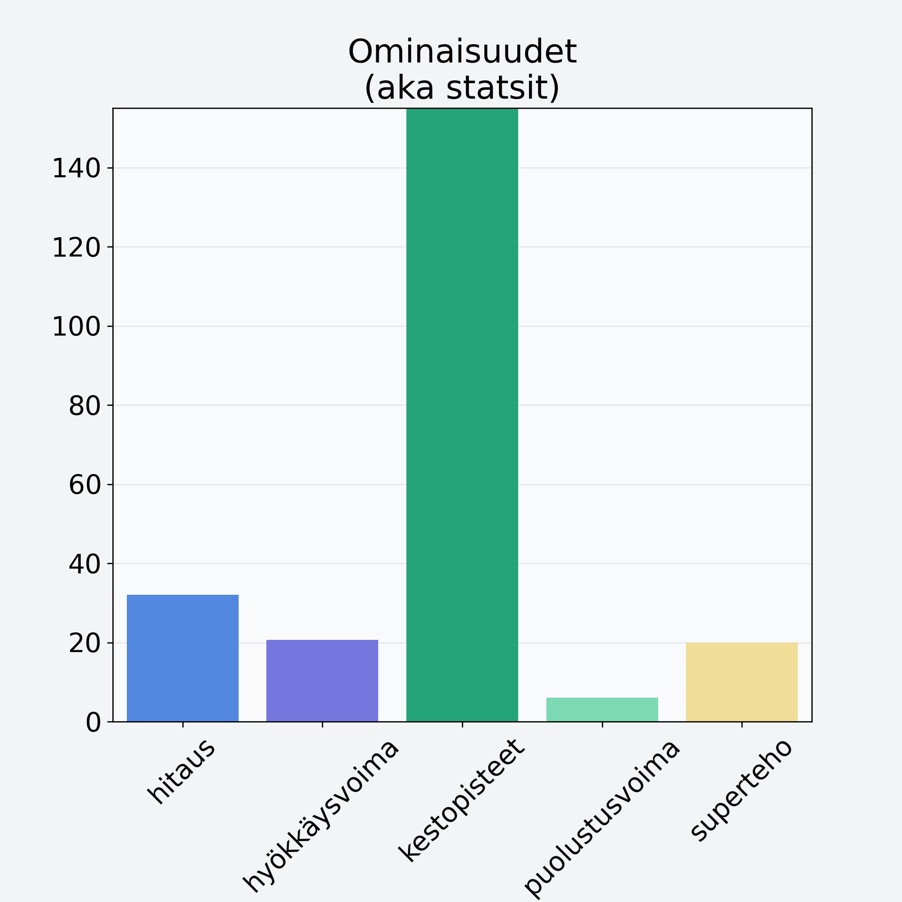

# Karpalo, kuivattu, karpalojauhe

## Kilpailijan tiedot { data-search-exclude }

:octicons-shield-check-24:{ .shieldMarker } Kilpailija on Finelin hyväksymä.

{ loading=lazy }

## Lisätiedot { data-search-exclude }
=== "Statsit numeerisena"

     | Voima          |   Arvo |
     |:---------------|-------:|
     | hitaus         |  32.03 |
     | hyökkäysvoima  |  20.63 |
     | kestopisteet   | 268.33 |
     | puolustusvoima |   6    |
     | superteho      |  19.93 |

=== "Samankaltaisia kilpailijoita"
    [Mustaherukka](/mustaherukka){ .md-button .md-button--primary .similarProduct }
    [Mustaherukka, kuivattu, mustaherukkajauhe](/mustaherukka-kuivattu-mustaherukkajauhe){ .md-button .md-button--primary .similarProduct }
    [Marja, keskiarvo](/marja-keskiarvo){ .md-button .md-button--primary .similarProduct }
    [Punaherukka](/punaherukka){ .md-button .md-button--primary .similarProduct }

!!! info inline start "Huomio"

    Hyökkäysvoima vaihtelee eri sotureilla :)
