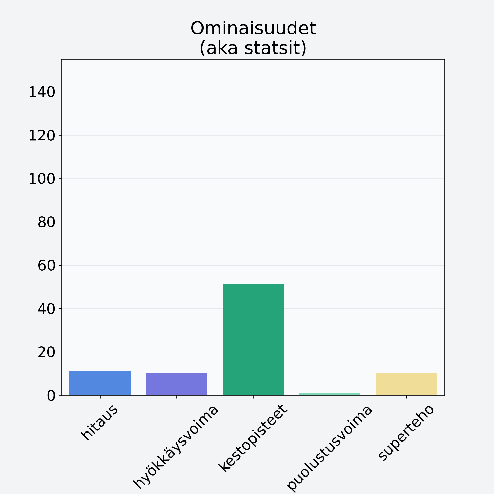

# Kirsikka, punnittu kivineen

## Kilpailijan tiedot { data-search-exclude }

:octicons-shield-check-24:{ .shieldMarker } Kilpailija on Finelin hyväksymä.

{ loading=lazy }

## Lisätiedot { data-search-exclude }
=== "Statsit numeerisena"

     | Voima          |   Arvo |
     |:---------------|-------:|
     | hitaus         |  11.35 |
     | hyökkäysvoima  |  10.37 |
     | kestopisteet   |  51.35 |
     | puolustusvoima |   0.8  |
     | superteho      |  10.37 |

=== "Samankaltaisia kilpailijoita"
    [Papaija, kuorittu](/papaija-kuorittu){ .md-button .md-button--primary .similarProduct }
    [Oliivi, keskiarvo, punnittu kivineen, öljyssä, vihreä/musta](/oliivi-keskiarvo-punnittu-kivineen-oljyssa-vihrea-musta){ .md-button .md-button--primary .similarProduct }
    [Vesimeloni, punnittu kuorineen](/vesimeloni-punnittu-kuorineen){ .md-button .md-button--primary .similarProduct }
    [Taateli, kuivattu, punnittu kivineen](/taateli-kuivattu-punnittu-kivineen){ .md-button .md-button--primary .similarProduct }
    [Sharon, kaki, persimon](/sharon-kaki-persimon){ .md-button .md-button--primary .similarProduct }
    [Eksoottinen hedelmä, keskiarvo, mango/papaija, kuorittu](/eksoottinen-hedelma-keskiarvo-mango-papaija-kuorittu){ .md-button .md-button--primary .similarProduct }

!!! info inline start "Huomio"

    Hyökkäysvoima vaihtelee eri sotureilla :)
