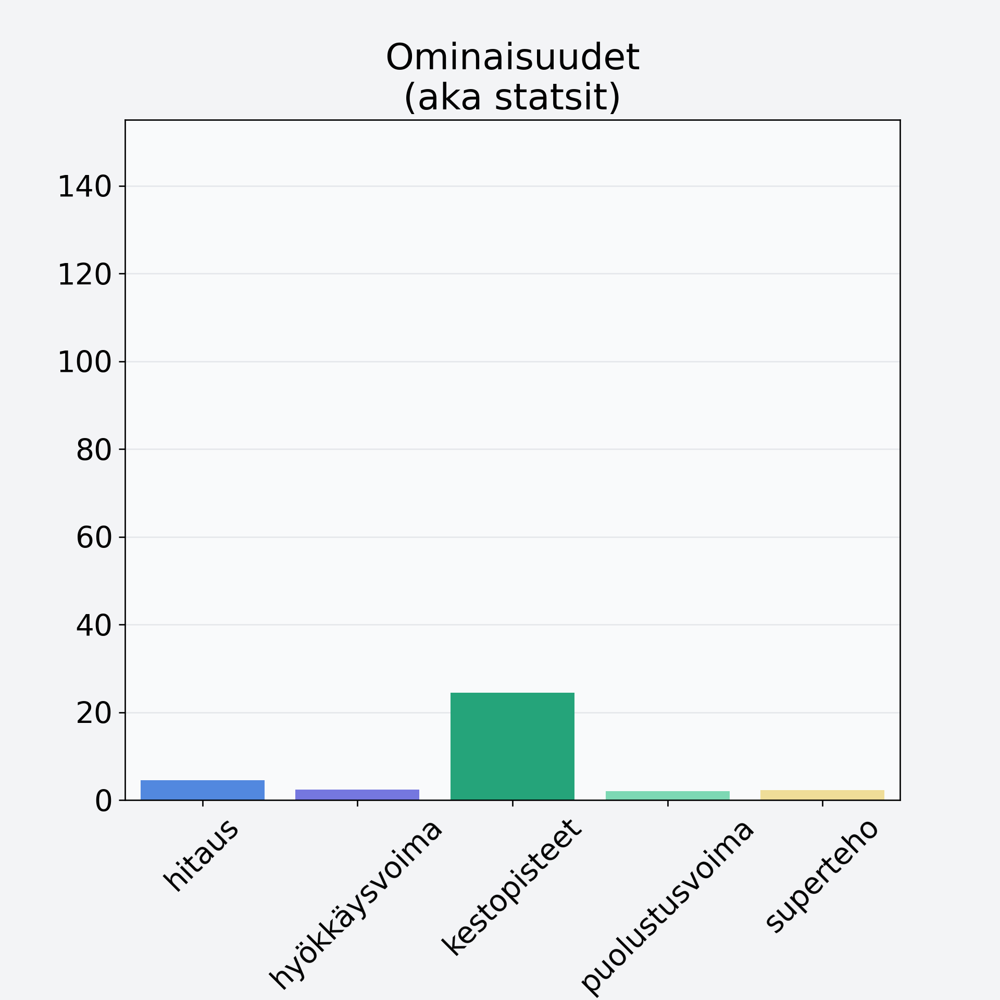

# Kukkakaali

## Kilpailijan tiedot { data-search-exclude }

:octicons-shield-check-24:{ .shieldMarker } Kilpailija on Finelin hyväksymä.

{ loading=lazy }

## Lisätiedot { data-search-exclude }
=== "Statsit numeerisena"

     | Voima          |   Arvo |
     |:---------------|-------:|
     | hitaus         |   4.56 |
     | hyökkäysvoima  |   2.35 |
     | kestopisteet   |  24.45 |
     | puolustusvoima |   2    |
     | superteho      |   2.2  |

=== "Samankaltaisia kilpailijoita"
    [Kiinankaali](/kiinankaali){ .md-button .md-button--primary .similarProduct }
    [Kyssäkaali, kaalirapi](/kyssakaali-kaalirapi){ .md-button .md-button--primary .similarProduct }
    [Ruusukaali](/ruusukaali){ .md-button .md-button--primary .similarProduct }
    [Punakaali](/punakaali){ .md-button .md-button--primary .similarProduct }
    [Lehtikaali](/lehtikaali){ .md-button .md-button--primary .similarProduct }
    [Valkokaali, keräkaali](/valkokaali-kerakaali){ .md-button .md-button--primary .similarProduct }

!!! info inline start "Huomio"

    Hyökkäysvoima vaihtelee eri sotureilla :)
