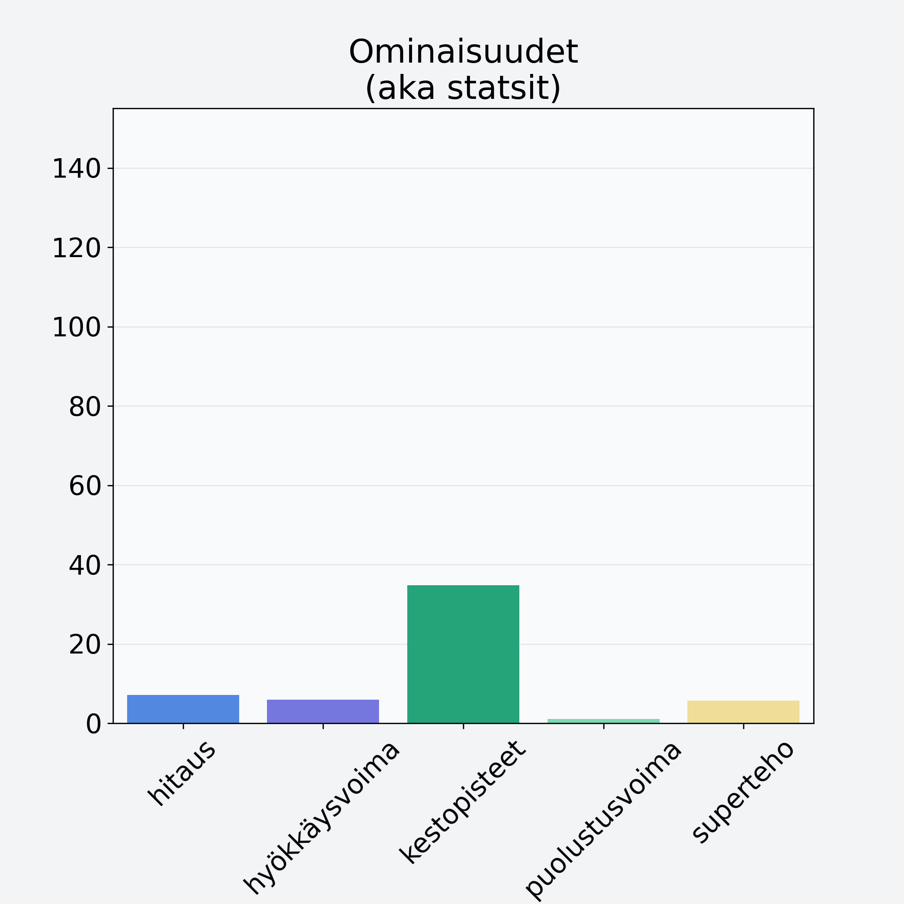

# Lanttu

## Kilpailijan tiedot { data-search-exclude }

:octicons-shield-check-24:{ .shieldMarker } Kilpailija on Finelin hyväksymä.

{ loading=lazy }

## Lisätiedot { data-search-exclude }
=== "Statsit numeerisena"

     | Voima          |   Arvo |
     |:---------------|-------:|
     | hitaus         |   7.08 |
     | hyökkäysvoima  |   5.88 |
     | kestopisteet   |  34.79 |
     | puolustusvoima |   1.1  |
     | superteho      |   5.73 |

=== "Samankaltaisia kilpailijoita"
    [Sekavihannes, porkkana, kukkakaali, herne, papu](/sekavihannes-porkkana-kukkakaali-herne-papu){ .md-button .md-button--primary .similarProduct }
    [Piparjuuri](/piparjuuri){ .md-button .md-button--primary .similarProduct }
    [Nauris](/nauris){ .md-button .md-button--primary .similarProduct }
    [Vesikastanja](/vesikastanja){ .md-button .md-button--primary .similarProduct }
    [Retiisi](/retiisi){ .md-button .md-button--primary .similarProduct }
    [Porkkana, kuivattu](/porkkana-kuivattu){ .md-button .md-button--primary .similarProduct }

!!! info inline start "Huomio"

    Hyökkäysvoima vaihtelee eri sotureilla :)
