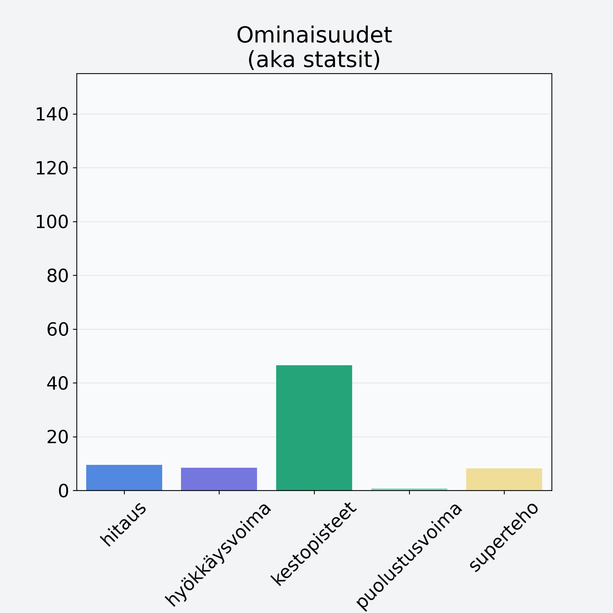

# Luumu, kivetön

## Kilpailijan tiedot { data-search-exclude }

:octicons-shield-check-24:{ .shieldMarker } Kilpailija on Finelin hyväksymä.

{ loading=lazy }

## Lisätiedot { data-search-exclude }
=== "Statsit numeerisena"

     | Voima          |   Arvo |
     |:---------------|-------:|
     | hitaus         |   9.45 |
     | hyökkäysvoima  |   8.4  |
     | kestopisteet   |  46.5  |
     | puolustusvoima |   0.75 |
     | superteho      |   8.2  |

=== "Samankaltaisia kilpailijoita"
    [Aprikoosi, keskiarvo, punnittu kivineen](/aprikoosi-keskiarvo-punnittu-kivineen){ .md-button .md-button--primary .similarProduct }
    [Persikka, kuivattu](/persikka-kuivattu){ .md-button .md-button--primary .similarProduct }
    [Omena, ulkomainen, kuorineen](/omena-ulkomainen-kuorineen){ .md-button .md-button--primary .similarProduct }
    [Luumu, tumma, kuivattu, punnittu kivineen](/luumu-tumma-kuivattu-punnittu-kivineen){ .md-button .md-button--primary .similarProduct }
    [Omena, kuivattu](/omena-kuivattu){ .md-button .md-button--primary .similarProduct }

!!! info inline start "Huomio"

    Hyökkäysvoima vaihtelee eri sotureilla :)
