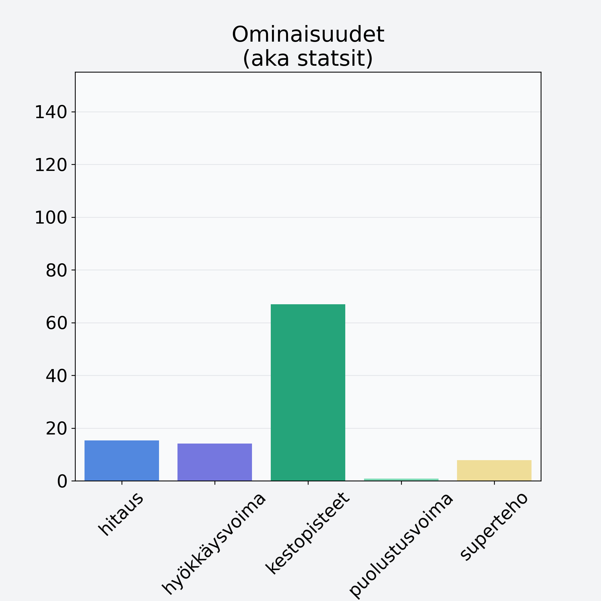

# Mango, kuorittu

## Kilpailijan tiedot { data-search-exclude }

:octicons-shield-check-24:{ .shieldMarker } Kilpailija on Finelin hyväksymä.

{ loading=lazy }

## Lisätiedot { data-search-exclude }
=== "Statsit numeerisena"

     | Voima          |   Arvo |
     |:---------------|-------:|
     | hitaus         |  15.28 |
     | hyökkäysvoima  |  14.08 |
     | kestopisteet   |  66.96 |
     | puolustusvoima |   0.82 |
     | superteho      |   7.88 |

=== "Samankaltaisia kilpailijoita"
    [Avokado, kuorittu, kivetön](/avokado-kuorittu-kiveton){ .md-button .md-button--primary .similarProduct }
    [Papaija, kuorittu](/papaija-kuorittu){ .md-button .md-button--primary .similarProduct }
    [Taateli, kuivattu, punnittu kivineen](/taateli-kuivattu-punnittu-kivineen){ .md-button .md-button--primary .similarProduct }
    [Sekahedelmä, kuivattu](/sekahedelma-kuivattu){ .md-button .md-button--primary .similarProduct }
    [Ananas, kuorittu](/ananas-kuorittu){ .md-button .md-button--primary .similarProduct }
    [Suklaarusina](/suklaarusina){ .md-button .md-button--primary .similarProduct }

!!! info inline start "Huomio"

    Hyökkäysvoima vaihtelee eri sotureilla :)
