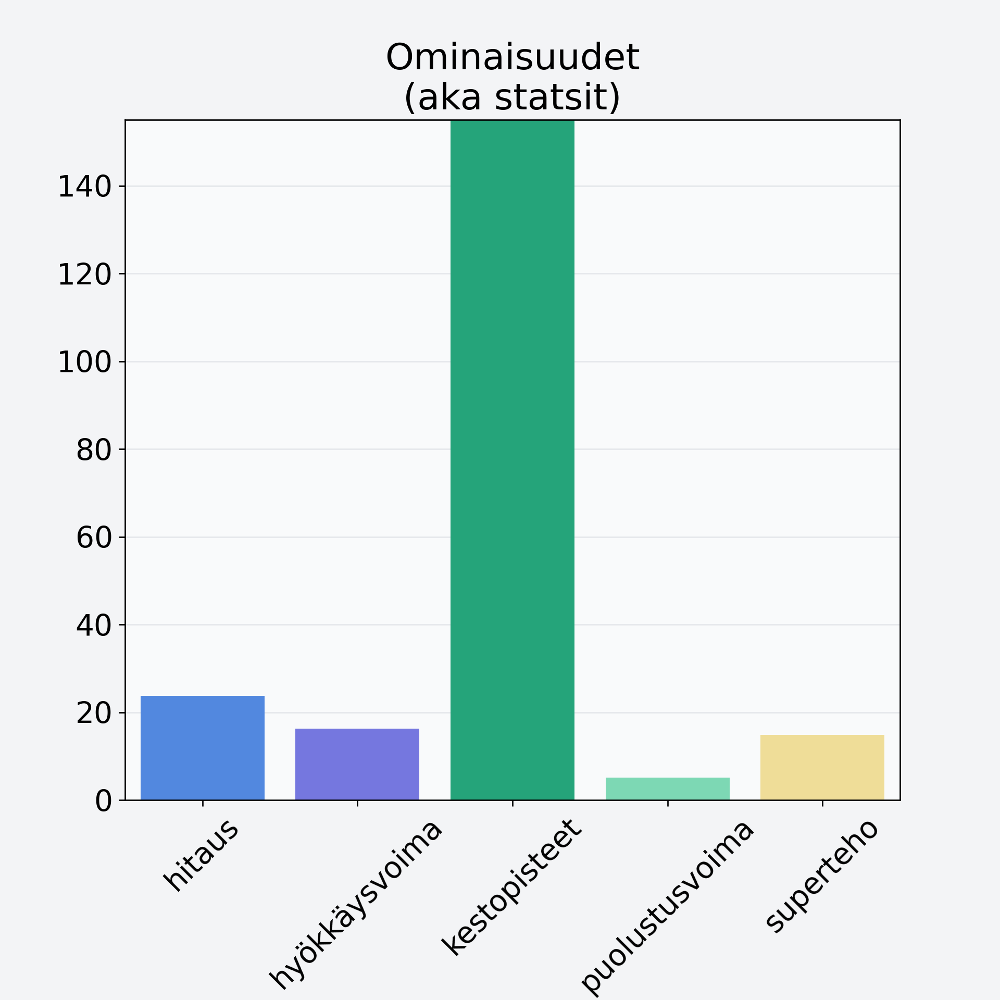

# Marja-aronia, kuivattu, marja-aroniajauhe

## Kilpailijan tiedot { data-search-exclude }

:octicons-shield-check-24:{ .shieldMarker } Kilpailija on Finelin hyväksymä.

{ loading=lazy }

## Lisätiedot { data-search-exclude }
=== "Statsit numeerisena"

     | Voima          |   Arvo |
     |:---------------|-------:|
     | hitaus         |  23.77 |
     | hyökkäysvoima  |  16.27 |
     | kestopisteet   | 242.11 |
     | puolustusvoima |   5.1  |
     | superteho      |  14.87 |

=== "Samankaltaisia kilpailijoita"
    [Juolukka](/juolukka){ .md-button .md-button--primary .similarProduct }
    [Tyrnimarja](/tyrnimarja){ .md-button .md-button--primary .similarProduct }
    [Punaherukka](/punaherukka){ .md-button .md-button--primary .similarProduct }
    [Karpalo](/karpalo){ .md-button .md-button--primary .similarProduct }

!!! info inline start "Huomio"

    Hyökkäysvoima vaihtelee eri sotureilla :)
