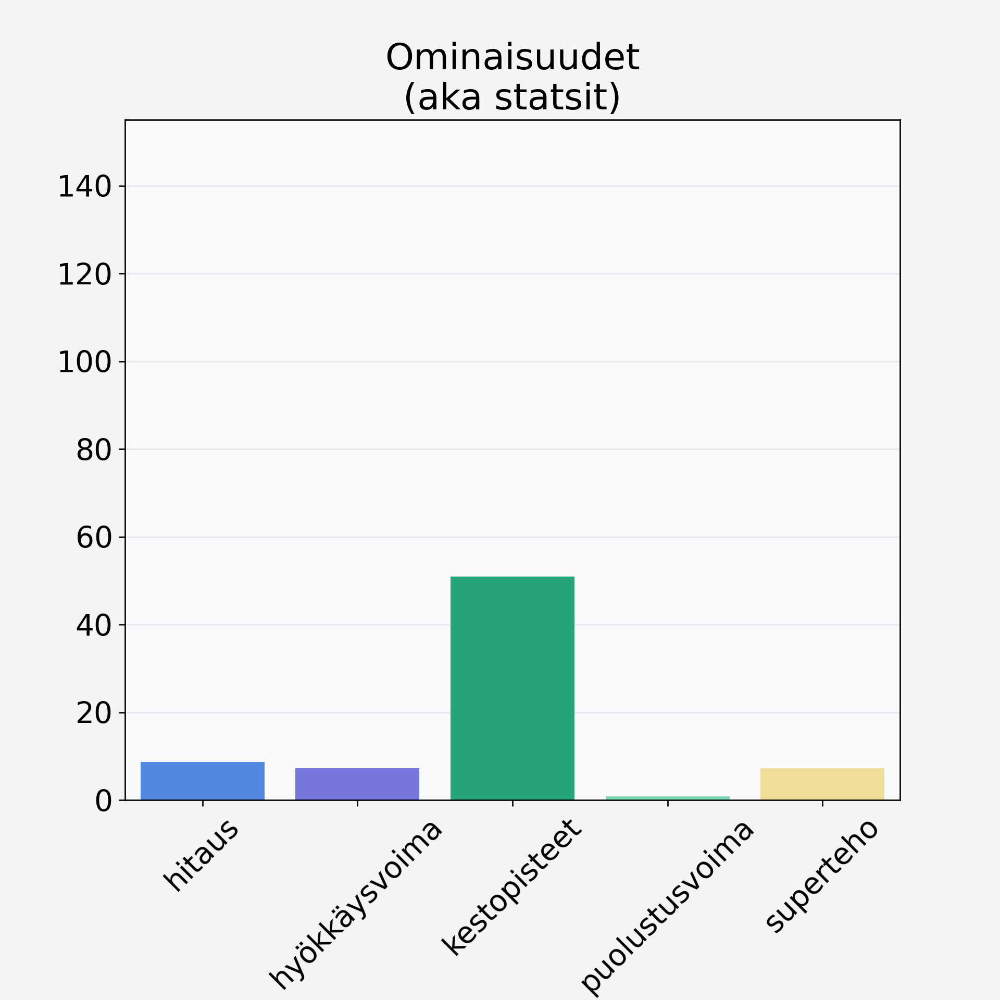

# Marja, keskiarvo

## Kilpailijan tiedot { data-search-exclude }

:octicons-shield-check-24:{ .shieldMarker } Kilpailija on Finelin hyväksymä.

{ loading=lazy }

## Lisätiedot { data-search-exclude }
=== "Statsit numeerisena"

     | Voima          |   Arvo |
     |:---------------|-------:|
     | hitaus         |   8.65 |
     | hyökkäysvoima  |   7.2  |
     | kestopisteet   |  50.93 |
     | puolustusvoima |   0.85 |
     | superteho      |   7.2  |

=== "Samankaltaisia kilpailijoita"
    [Lakka, suomuurain, hilla](/lakka-suomuurain-hilla){ .md-button .md-button--primary .similarProduct }
    [Marja-aronia](/marja-aronia){ .md-button .md-button--primary .similarProduct }
    [Pihlajanmarja, kuivattu, pihlajanmarjajauhe](/pihlajanmarja-kuivattu-pihlajanmarjajauhe){ .md-button .md-button--primary .similarProduct }
    [Juolukka](/juolukka){ .md-button .md-button--primary .similarProduct }
    [Karviainen](/karviainen){ .md-button .md-button--primary .similarProduct }

!!! info inline start "Huomio"

    Hyökkäysvoima vaihtelee eri sotureilla :)
