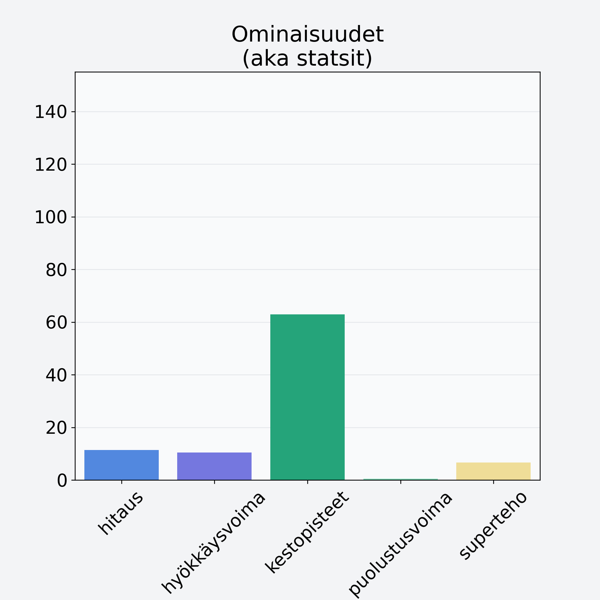

# Mustajuuri

## Kilpailijan tiedot { data-search-exclude }

:octicons-shield-check-24:{ .shieldMarker } Kilpailija on Finelin hyväksymä.

{ loading=lazy }

## Lisätiedot { data-search-exclude }
=== "Statsit numeerisena"

     | Voima          |   Arvo |
     |:---------------|-------:|
     | hitaus         |  11.4  |
     | hyökkäysvoima  |  10.5  |
     | kestopisteet   |  62.97 |
     | puolustusvoima |   0.5  |
     | superteho      |   6.6  |

=== "Samankaltaisia kilpailijoita"
    [Piparjuuri](/piparjuuri){ .md-button .md-button--primary .similarProduct }
    [Porkkana, kuivattu](/porkkana-kuivattu){ .md-button .md-button--primary .similarProduct }
    [Palsternakka](/palsternakka){ .md-button .md-button--primary .similarProduct }
    [Valkoretikka](/valkoretikka){ .md-button .md-button--primary .similarProduct }
    [Retiisi](/retiisi){ .md-button .md-button--primary .similarProduct }
    [Inkivääri, juurakko, raaka](/inkivaari-juurakko-raaka){ .md-button .md-button--primary .similarProduct }

!!! info inline start "Huomio"

    Hyökkäysvoima vaihtelee eri sotureilla :)
