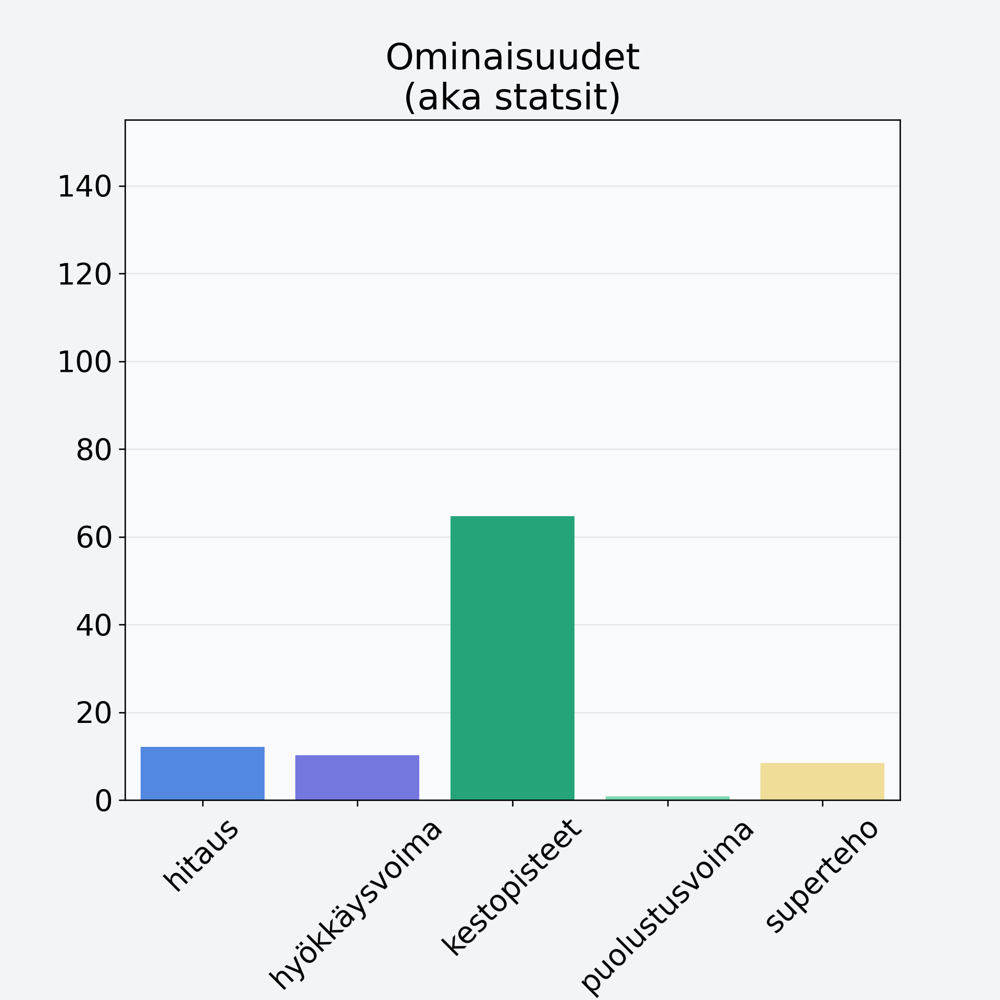

# Mustikka, metsämustikka

## Kilpailijan tiedot { data-search-exclude }

:octicons-shield-check-24:{ .shieldMarker } Kilpailija on Finelin hyväksymä.

{ loading=lazy }

## Lisätiedot { data-search-exclude }
=== "Statsit numeerisena"

     | Voima          |   Arvo |
     |:---------------|-------:|
     | hitaus         |  12.06 |
     | hyökkäysvoima  |  10.18 |
     | kestopisteet   |  64.74 |
     | puolustusvoima |   0.82 |
     | superteho      |   8.39 |

=== "Samankaltaisia kilpailijoita"
    [Punaherukka](/punaherukka){ .md-button .md-button--primary .similarProduct }
    [Vadelma](/vadelma){ .md-button .md-button--primary .similarProduct }
    [Karviainen](/karviainen){ .md-button .md-button--primary .similarProduct }

!!! info inline start "Huomio"

    Hyökkäysvoima vaihtelee eri sotureilla :)
