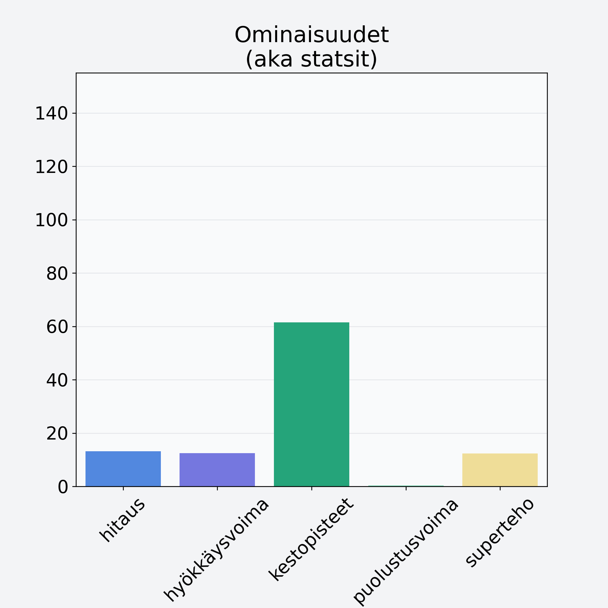

# Mustikka, pensasmustikka

## Kilpailijan tiedot { data-search-exclude }

:octicons-shield-check-24:{ .shieldMarker } Kilpailija on Finelin hyväksymä.

{ loading=lazy }

## Lisätiedot { data-search-exclude }
=== "Statsit numeerisena"

     | Voima          |   Arvo |
     |:---------------|-------:|
     | hitaus         |  13.17 |
     | hyökkäysvoima  |  12.52 |
     | kestopisteet   |  61.49 |
     | puolustusvoima |   0.3  |
     | superteho      |  12.37 |

=== "Samankaltaisia kilpailijoita"
    [Marja, keskiarvo](/marja-keskiarvo){ .md-button .md-button--primary .similarProduct }
    [Ruusunmarja](/ruusunmarja){ .md-button .md-button--primary .similarProduct }
    [Puolukka, kuivattu, puolukkajauhe](/puolukka-kuivattu-puolukkajauhe){ .md-button .md-button--primary .similarProduct }
    [Vadelma](/vadelma){ .md-button .md-button--primary .similarProduct }
    [Mustikka, metsämustikka](/mustikka-metsamustikka){ .md-button .md-button--primary .similarProduct }

!!! info inline start "Huomio"

    Hyökkäysvoima vaihtelee eri sotureilla :)
