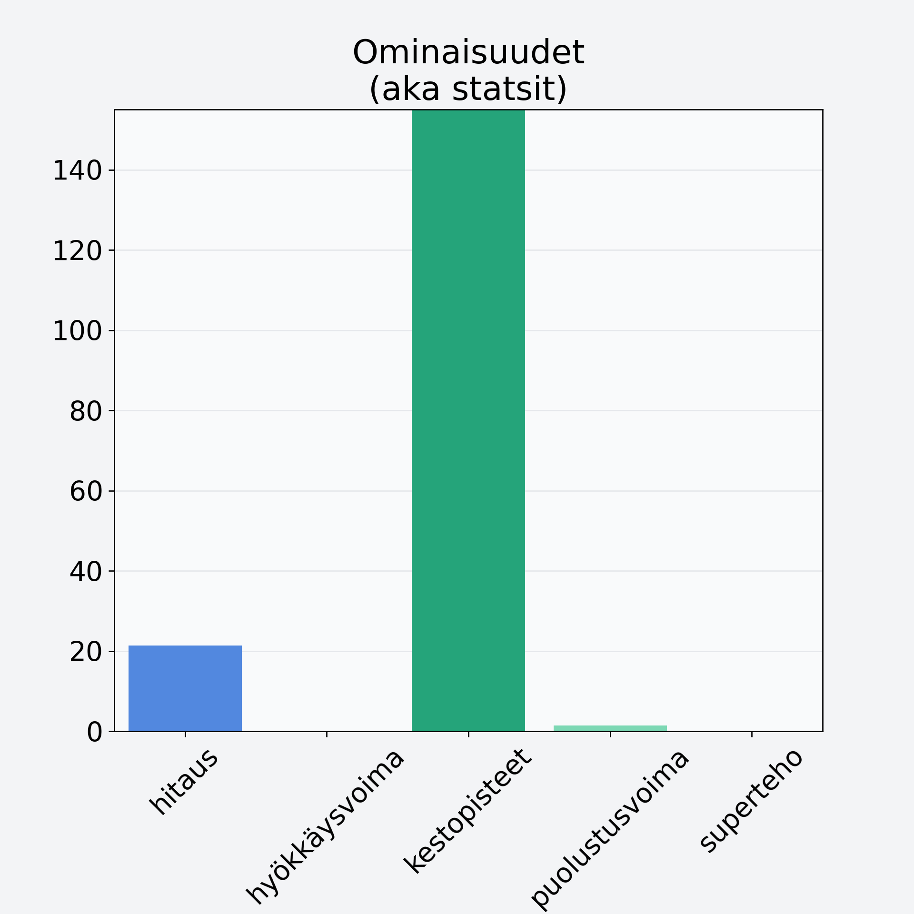

# Oliivi, keskiarvo, kivetön, öljyssä, vihreä/musta

## Kilpailijan tiedot { data-search-exclude }

:octicons-shield-check-24:{ .shieldMarker } Kilpailija on Finelin hyväksymä.

{ loading=lazy }

## Lisätiedot { data-search-exclude }
=== "Statsit numeerisena"

     | Voima          |   Arvo |
     |:---------------|-------:|
     | hitaus         |  21.38 |
     | hyökkäysvoima  |   0    |
     | kestopisteet   | 190.87 |
     | puolustusvoima |   1.38 |
     | superteho      |   0    |

=== "Samankaltaisia kilpailijoita"
    [Meloni, verkkomeloni/cantaloupemeloni, kuorittu](/meloni-verkkomeloni-cantaloupemeloni-kuorittu){ .md-button .md-button--primary .similarProduct }
    [Papaija, kuivattu](/papaija-kuivattu){ .md-button .md-button--primary .similarProduct }

!!! info inline start "Huomio"

    Hyökkäysvoima vaihtelee eri sotureilla :)
