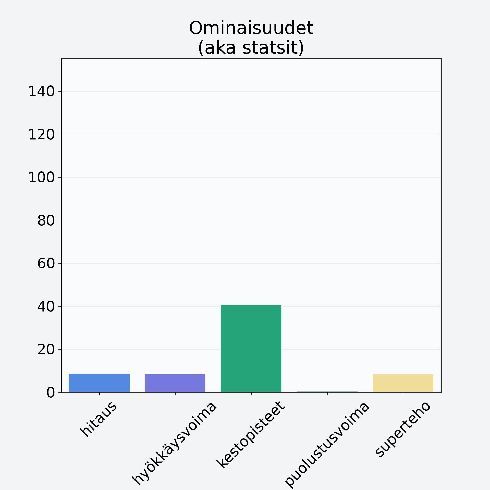

# Omena, kotimainen, kuorittu

## Kilpailijan tiedot { data-search-exclude }

:octicons-shield-check-24:{ .shieldMarker } Kilpailija on Finelin hyväksymä.

{ loading=lazy }

## Lisätiedot { data-search-exclude }
=== "Statsit numeerisena"

     | Voima          |   Arvo |
     |:---------------|-------:|
     | hitaus         |   8.6  |
     | hyökkäysvoima  |   8.31 |
     | kestopisteet   |  40.53 |
     | puolustusvoima |   0.19 |
     | superteho      |   8.21 |

=== "Samankaltaisia kilpailijoita"
    [Omena, kotimainen, kuorittu](/omena-kotimainen-kuorittu){ .md-button .md-button--primary .similarProduct }
    [Omena, ulkomainen, kuorineen](/omena-ulkomainen-kuorineen){ .md-button .md-button--primary .similarProduct }

!!! info inline start "Huomio"

    Hyökkäysvoima vaihtelee eri sotureilla :)
