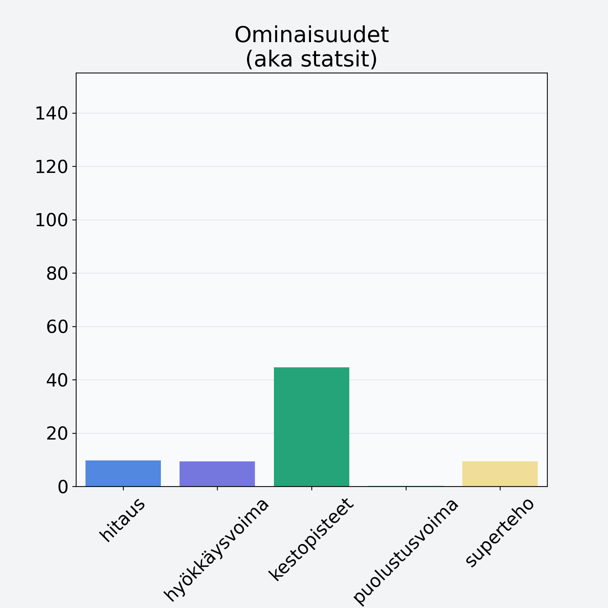

# Omena, ulkomainen, kuorittu

## Kilpailijan tiedot { data-search-exclude }

:octicons-shield-check-24:{ .shieldMarker } Kilpailija on Finelin hyväksymä.

{ loading=lazy }

## Lisätiedot { data-search-exclude }
=== "Statsit numeerisena"

     | Voima          |   Arvo |
     |:---------------|-------:|
     | hitaus         |   9.71 |
     | hyökkäysvoima  |   9.42 |
     | kestopisteet   |  44.68 |
     | puolustusvoima |   0.19 |
     | superteho      |   9.32 |

=== "Samankaltaisia kilpailijoita"
    [Päärynä, punnittu kuorineen](/paaryna-punnittu-kuorineen){ .md-button .md-button--primary .similarProduct }
    [Aprikoosi, keskiarvo, punnittu kivineen](/aprikoosi-keskiarvo-punnittu-kivineen){ .md-button .md-button--primary .similarProduct }
    [Aprikoosi, keskiarvo, kivetön](/aprikoosi-keskiarvo-kiveton){ .md-button .md-button--primary .similarProduct }
    [Luumu, kivetön](/luumu-kiveton){ .md-button .md-button--primary .similarProduct }
    [Luumu, kivetön, kuivattu](/luumu-kiveton-kuivattu){ .md-button .md-button--primary .similarProduct }
    [Omena, ulkomainen, kuorittu](/omena-ulkomainen-kuorittu){ .md-button .md-button--primary .similarProduct }

!!! info inline start "Huomio"

    Hyökkäysvoima vaihtelee eri sotureilla :)
