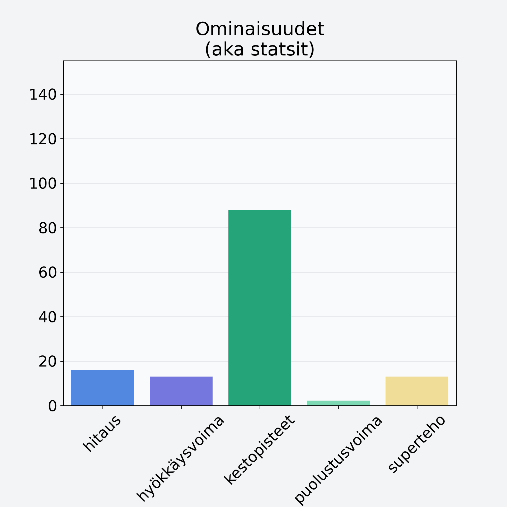

# Passionhedelmä

## Kilpailijan tiedot { data-search-exclude }

:octicons-shield-check-24:{ .shieldMarker } Kilpailija on Finelin hyväksymä.

{ loading=lazy }

## Lisätiedot { data-search-exclude }
=== "Statsit numeerisena"

     | Voima          |   Arvo |
     |:---------------|-------:|
     | hitaus         |  15.9  |
     | hyökkäysvoima  |  13    |
     | kestopisteet   |  87.83 |
     | puolustusvoima |   2.2  |
     | superteho      |  13    |

=== "Samankaltaisia kilpailijoita"
    [Ananas, kuivattu, jogurttikuorrutus](/ananas-kuivattu-jogurttikuorrutus){ .md-button .md-button--primary .similarProduct }
    [Hunajameloni, punnittu kuorineen](/hunajameloni-punnittu-kuorineen){ .md-button .md-button--primary .similarProduct }
    [Papaija, kuivattu](/papaija-kuivattu){ .md-button .md-button--primary .similarProduct }
    [Oliivi, keskiarvo, kivetön, öljyssä, vihreä/musta](/oliivi-keskiarvo-kiveton-oljyssa-vihrea-musta){ .md-button .md-button--primary .similarProduct }
    [Papaija, kuorittu](/papaija-kuorittu){ .md-button .md-button--primary .similarProduct }
    [Kirsikka, kivetön](/kirsikka-kiveton){ .md-button .md-button--primary .similarProduct }

!!! info inline start "Huomio"

    Hyökkäysvoima vaihtelee eri sotureilla :)
