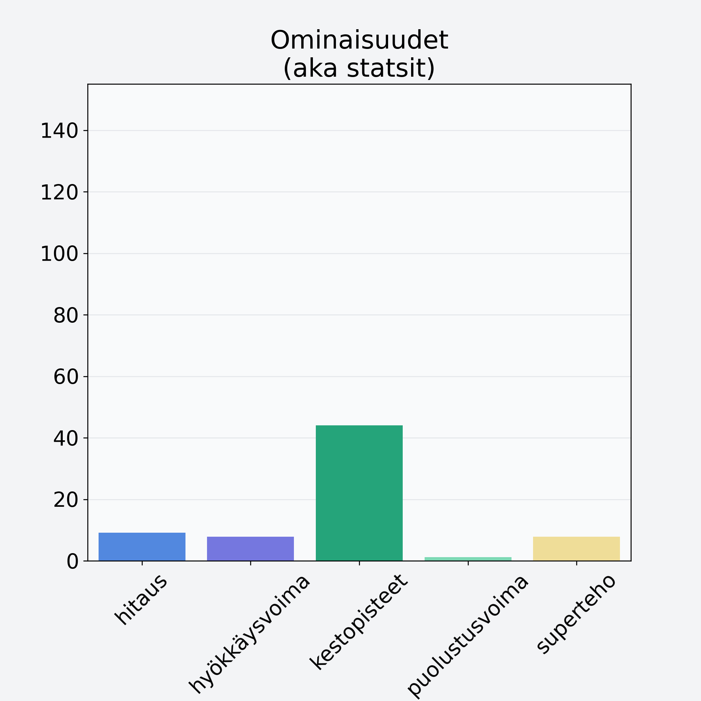

# Persikka/nektariini, kuorittu, kivetön

## Kilpailijan tiedot { data-search-exclude }

:octicons-shield-check-24:{ .shieldMarker } Kilpailija on Finelin hyväksymä.

{ loading=lazy }

## Lisätiedot { data-search-exclude }
=== "Statsit numeerisena"

     | Voima          |   Arvo |
     |:---------------|-------:|
     | hitaus         |   9.16 |
     | hyökkäysvoima  |   7.8  |
     | kestopisteet   |  44.05 |
     | puolustusvoima |   1.15 |
     | superteho      |   7.8  |

=== "Samankaltaisia kilpailijoita"
    [Aprikoosi, kuivattu](/aprikoosi-kuivattu){ .md-button .md-button--primary .similarProduct }
    [Päärynä, punnittu kuorineen](/paaryna-punnittu-kuorineen){ .md-button .md-button--primary .similarProduct }
    [Omena, ulkomainen, kuorittu](/omena-ulkomainen-kuorittu){ .md-button .md-button--primary .similarProduct }
    [Persikka/nektariini, keskiarvo, punnittu kivineen](/persikka-nektariini-keskiarvo-punnittu-kivineen){ .md-button .md-button--primary .similarProduct }

!!! info inline start "Huomio"

    Hyökkäysvoima vaihtelee eri sotureilla :)
