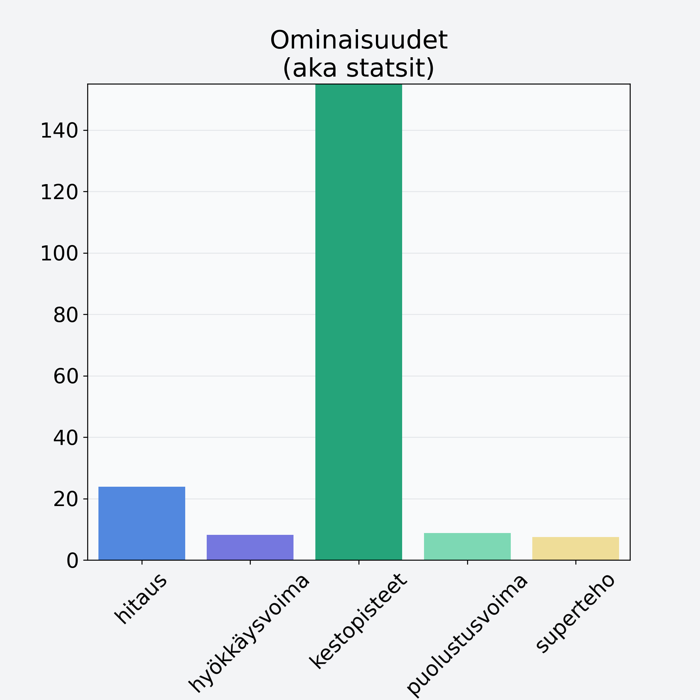

# Pihlajanmarja, kuivattu, pihlajanmarjajauhe

## Kilpailijan tiedot { data-search-exclude }

:octicons-shield-check-24:{ .shieldMarker } Kilpailija on Finelin hyväksymä.

{ loading=lazy }

## Lisätiedot { data-search-exclude }
=== "Statsit numeerisena"

     | Voima          |   Arvo |
     |:---------------|-------:|
     | hitaus         |  23.89 |
     | hyökkäysvoima  |   8.19 |
     | kestopisteet   | 263.51 |
     | puolustusvoima |   8.8  |
     | superteho      |   7.49 |

=== "Samankaltaisia kilpailijoita"
    [Ruusunmarja](/ruusunmarja){ .md-button .md-button--primary .similarProduct }
    [Mansikka](/mansikka){ .md-button .md-button--primary .similarProduct }
    [Mustikka, pensasmustikka](/mustikka-pensasmustikka){ .md-button .md-button--primary .similarProduct }
    [Mustaherukka, kuivattu, mustaherukkajauhe](/mustaherukka-kuivattu-mustaherukkajauhe){ .md-button .md-button--primary .similarProduct }
    [Katajanmarja](/katajanmarja){ .md-button .md-button--primary .similarProduct }

!!! info inline start "Huomio"

    Hyökkäysvoima vaihtelee eri sotureilla :)
