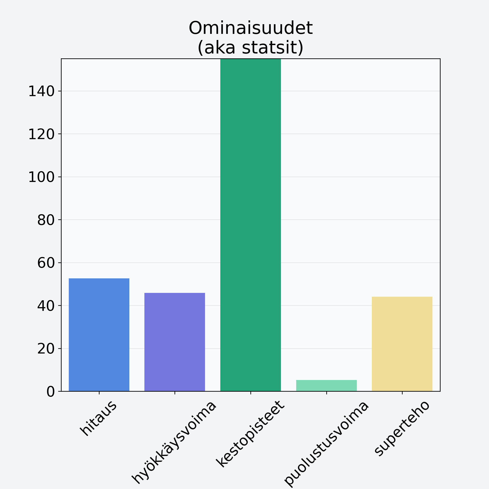

# Porkkana, kuivattu

## Kilpailijan tiedot { data-search-exclude }

:octicons-shield-check-24:{ .shieldMarker } Kilpailija on Finelin hyväksymä.

{ loading=lazy }

## Lisätiedot { data-search-exclude }
=== "Statsit numeerisena"

     | Voima          |   Arvo |
     |:---------------|-------:|
     | hitaus         |  52.61 |
     | hyökkäysvoima  |  45.8  |
     | kestopisteet   | 268.75 |
     | puolustusvoima |   5.21 |
     | superteho      |  44.1  |

=== "Samankaltaisia kilpailijoita"
    [Inkivääri, juurakko, raaka](/inkivaari-juurakko-raaka){ .md-button .md-button--primary .similarProduct }
    [Juuriselleri, mukulaselleri](/juuriselleri-mukulaselleri){ .md-button .md-button--primary .similarProduct }
    [Lanttu](/lanttu){ .md-button .md-button--primary .similarProduct }
    [Sekavihannes, porkkana, kukkakaali, herne, papu](/sekavihannes-porkkana-kukkakaali-herne-papu){ .md-button .md-button--primary .similarProduct }

!!! info inline start "Huomio"

    Hyökkäysvoima vaihtelee eri sotureilla :)
