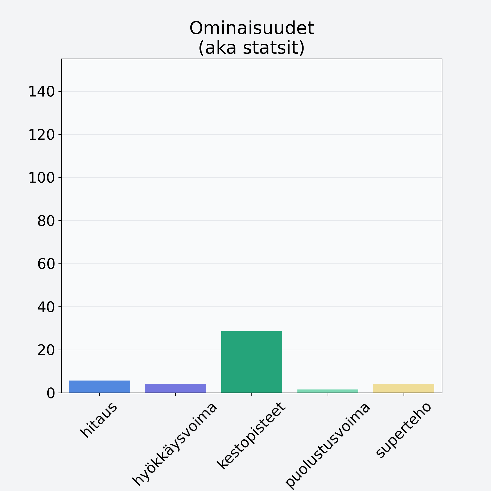

# Punakaali

## Kilpailijan tiedot { data-search-exclude }

:octicons-shield-check-24:{ .shieldMarker } Kilpailija on Finelin hyväksymä.

{ loading=lazy }

## Lisätiedot { data-search-exclude }
=== "Statsit numeerisena"

     | Voima          |   Arvo |
     |:---------------|-------:|
     | hitaus         |   5.75 |
     | hyökkäysvoima  |   4.15 |
     | kestopisteet   |  28.62 |
     | puolustusvoima |   1.5  |
     | superteho      |   4    |

=== "Samankaltaisia kilpailijoita"
    [Kiinankaali](/kiinankaali){ .md-button .md-button--primary .similarProduct }
    [Lehtikaali](/lehtikaali){ .md-button .md-button--primary .similarProduct }
    [Ruusukaali](/ruusukaali){ .md-button .md-button--primary .similarProduct }
    [Kukkakaali](/kukkakaali){ .md-button .md-button--primary .similarProduct }
    [Punakaali](/punakaali){ .md-button .md-button--primary .similarProduct }

!!! info inline start "Huomio"

    Hyökkäysvoima vaihtelee eri sotureilla :)
