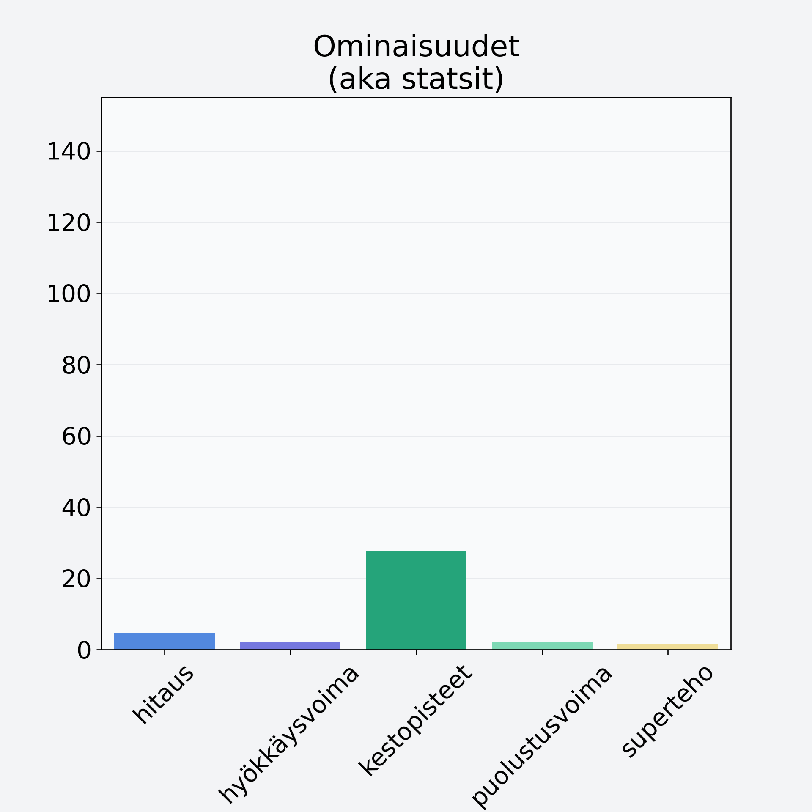

# Punikkitatti

## Kilpailijan tiedot { data-search-exclude }

:octicons-shield-check-24:{ .shieldMarker } Kilpailija on Finelin hyväksymä.

{ loading=lazy }

## Lisätiedot { data-search-exclude }
=== "Statsit numeerisena"

     | Voima          |   Arvo |
     |:---------------|-------:|
     | hitaus         |   4.64 |
     | hyökkäysvoima  |   1.99 |
     | kestopisteet   |  27.79 |
     | puolustusvoima |   2.1  |
     | superteho      |   1.69 |

=== "Samankaltaisia kilpailijoita"
    [Herkkutatti](/herkkutatti){ .md-button .md-button--primary .similarProduct }
    [Siitakesieni](/siitakesieni){ .md-button .md-button--primary .similarProduct }
    [Suppilovahvero](/suppilovahvero){ .md-button .md-button--primary .similarProduct }
    [Sieni rouskut, suolattu, käyttövalmis](/sieni-rouskut-suolattu-kayttovalmis){ .md-button .md-button--primary .similarProduct }
    [Quorn, fileet, kuutiot, rouhe](/quorn-fileet-kuutiot-rouhe){ .md-button .md-button--primary .similarProduct }
    [Karvarousku](/karvarousku){ .md-button .md-button--primary .similarProduct }

!!! info inline start "Huomio"

    Hyökkäysvoima vaihtelee eri sotureilla :)
