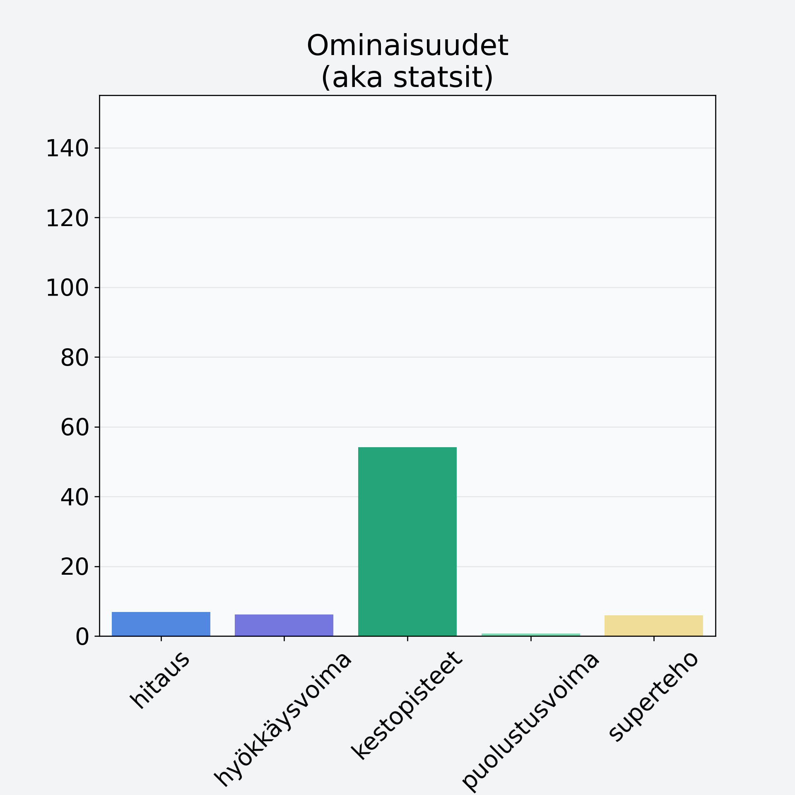

# Ruusunmarja

## Kilpailijan tiedot { data-search-exclude }

:octicons-shield-check-24:{ .shieldMarker } Kilpailija on Finelin hyväksymä.

{ loading=lazy }

## Lisätiedot { data-search-exclude }
=== "Statsit numeerisena"

     | Voima          |   Arvo |
     |:---------------|-------:|
     | hitaus         |   6.92 |
     | hyökkäysvoima  |   6.12 |
     | kestopisteet   |  54.1  |
     | puolustusvoima |   0.7  |
     | superteho      |   5.97 |

=== "Samankaltaisia kilpailijoita"
    [Tyrnimarja, kuivattu, tyrnimarjajauhe](/tyrnimarja-kuivattu-tyrnimarjajauhe){ .md-button .md-button--primary .similarProduct }
    [Karpalo, kuivattu, karpalojauhe](/karpalo-kuivattu-karpalojauhe){ .md-button .md-button--primary .similarProduct }
    [Mustaherukka, kuivattu, mustaherukkajauhe](/mustaherukka-kuivattu-mustaherukkajauhe){ .md-button .md-button--primary .similarProduct }
    [Vadelma](/vadelma){ .md-button .md-button--primary .similarProduct }

!!! info inline start "Huomio"

    Hyökkäysvoima vaihtelee eri sotureilla :)
