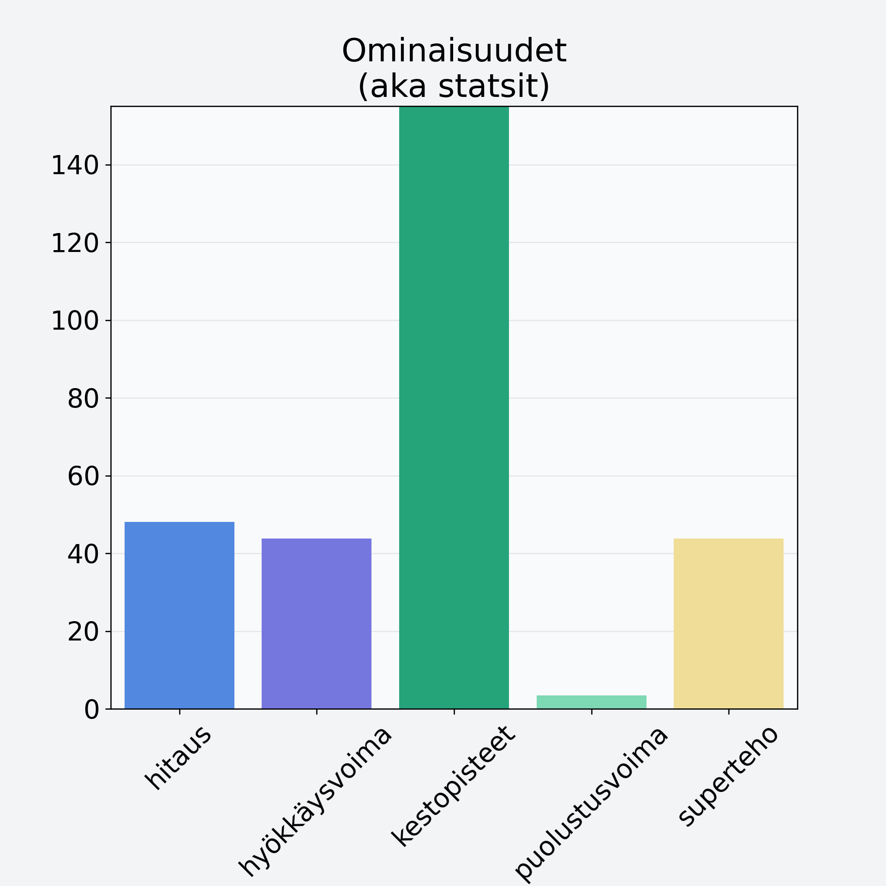

# Sekahedelmä, kuivattu

## Kilpailijan tiedot { data-search-exclude }

:octicons-shield-check-24:{ .shieldMarker } Kilpailija on Finelin hyväksymä.

{ loading=lazy }

## Lisätiedot { data-search-exclude }
=== "Statsit numeerisena"

     | Voima          |   Arvo |
     |:---------------|-------:|
     | hitaus         |  48.14 |
     | hyökkäysvoima  |  43.86 |
     | kestopisteet   | 222.86 |
     | puolustusvoima |   3.48 |
     | superteho      |  43.86 |

=== "Samankaltaisia kilpailijoita"
    [Ananas, kuivattu, jogurttikuorrutus](/ananas-kuivattu-jogurttikuorrutus){ .md-button .md-button--primary .similarProduct }
    [Erikoishedelmä, eksoottinen, keskiarvo, mango/papaija, kuivattu](/erikoishedelma-eksoottinen-keskiarvo-mango-papaija-kuivattu){ .md-button .md-button--primary .similarProduct }
    [Mango, kuivattu](/mango-kuivattu){ .md-button .md-button--primary .similarProduct }
    [Oliivi, keskiarvo, kivetön, suolaliemessä, vihreä](/oliivi-keskiarvo-kiveton-suolaliemessa-vihrea){ .md-button .md-button--primary .similarProduct }

!!! info inline start "Huomio"

    Hyökkäysvoima vaihtelee eri sotureilla :)
