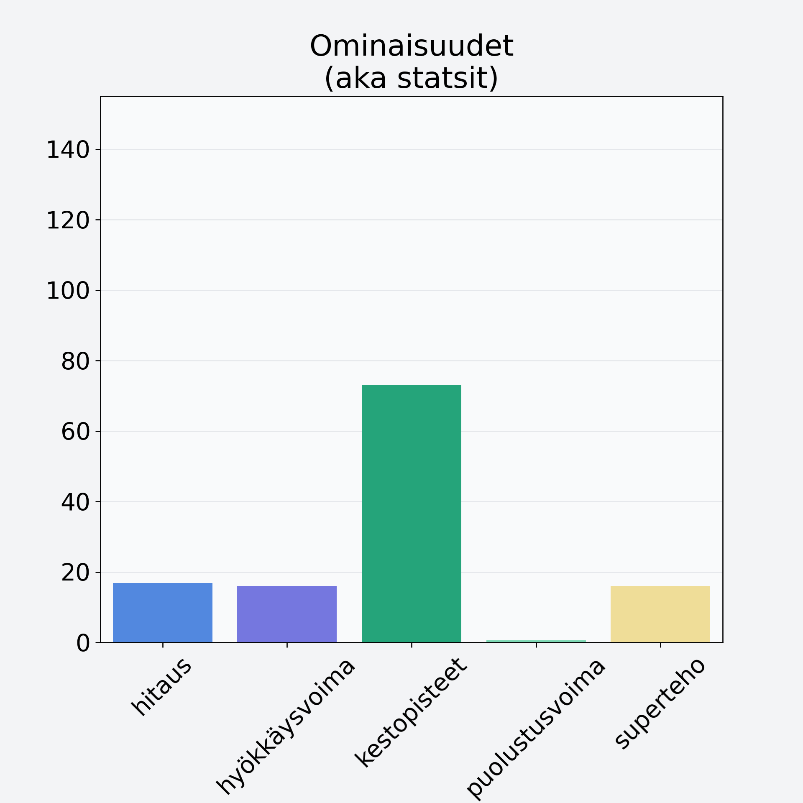

# Sharon, kaki, persimon

## Kilpailijan tiedot { data-search-exclude }

:octicons-shield-check-24:{ .shieldMarker } Kilpailija on Finelin hyväksymä.

{ loading=lazy }

## Lisätiedot { data-search-exclude }
=== "Statsit numeerisena"

     | Voima          |   Arvo |
     |:---------------|-------:|
     | hitaus         |  16.8  |
     | hyökkäysvoima  |  16    |
     | kestopisteet   |  73.04 |
     | puolustusvoima |   0.6  |
     | superteho      |  16    |

=== "Samankaltaisia kilpailijoita"
    [Viinirypäle, keskiarvo, kivetön, vihreä/tumma](/viinirypale-keskiarvo-kiveton-vihrea-tumma){ .md-button .md-button--primary .similarProduct }
    [Suklaarusina](/suklaarusina){ .md-button .md-button--primary .similarProduct }
    [Papaija, kuorittu](/papaija-kuorittu){ .md-button .md-button--primary .similarProduct }

!!! info inline start "Huomio"

    Hyökkäysvoima vaihtelee eri sotureilla :)
