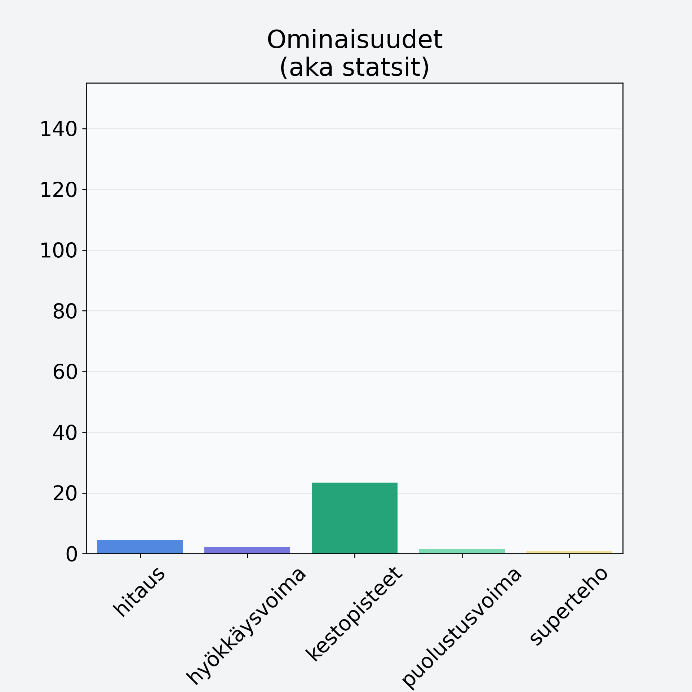

# Sieni rouskut, suolattu, käyttövalmis

## Kilpailijan tiedot { data-search-exclude }

:octicons-shield-check-24:{ .shieldMarker } Kilpailija on Finelin hyväksymä.

{ loading=lazy }

## Lisätiedot { data-search-exclude }
=== "Statsit numeerisena"

     | Voima          |   Arvo |
     |:---------------|-------:|
     | hitaus         |   4.36 |
     | hyökkäysvoima  |   2.3  |
     | kestopisteet   |  23.33 |
     | puolustusvoima |   1.56 |
     | superteho      |   0.8  |

=== "Samankaltaisia kilpailijoita"
    [Karvarousku](/karvarousku){ .md-button .md-button--primary .similarProduct }
    [Etikkasienisäilyke](/etikkasienisailyke){ .md-button .md-button--primary .similarProduct }
    [Osterivinokas](/osterivinokas){ .md-button .md-button--primary .similarProduct }

!!! info inline start "Huomio"

    Hyökkäysvoima vaihtelee eri sotureilla :)
