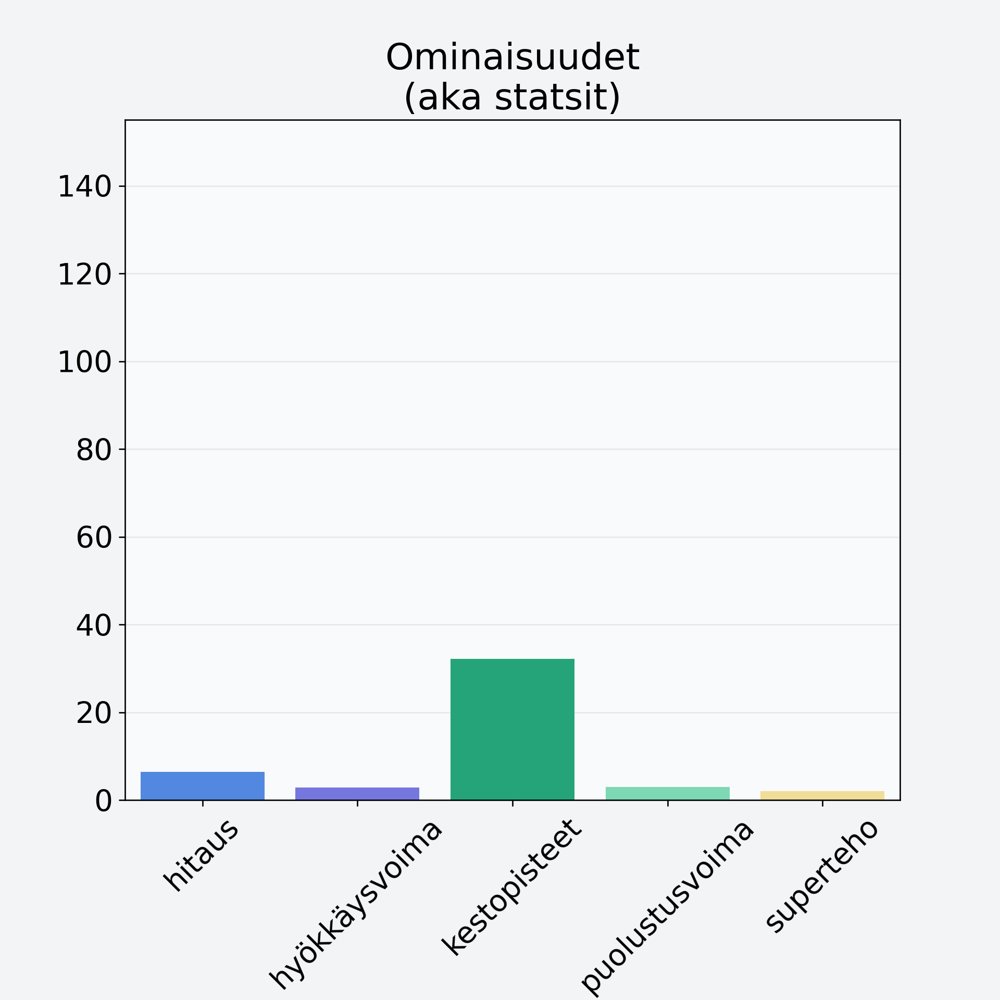

# Sieni, tatti, hapero

## Kilpailijan tiedot { data-search-exclude }

:octicons-shield-check-24:{ .shieldMarker } Kilpailija on Finelin hyväksymä.

{ loading=lazy }

## Lisätiedot { data-search-exclude }
=== "Statsit numeerisena"

     | Voima          |   Arvo |
     |:---------------|-------:|
     | hitaus         |   6.38 |
     | hyökkäysvoima  |   2.9  |
     | kestopisteet   |  32.14 |
     | puolustusvoima |   2.98 |
     | superteho      |   2    |

=== "Samankaltaisia kilpailijoita"
    [Karvarousku](/karvarousku){ .md-button .md-button--primary .similarProduct }
    [Herkkusieni, säilyke](/herkkusieni-sailyke){ .md-button .md-button--primary .similarProduct }
    [Herkkusieni](/herkkusieni){ .md-button .md-button--primary .similarProduct }
    [Lampaankääpä](/lampaankaapa){ .md-button .md-button--primary .similarProduct }
    [Haaparousku](/haaparousku){ .md-button .md-button--primary .similarProduct }

!!! info inline start "Huomio"

    Hyökkäysvoima vaihtelee eri sotureilla :)
