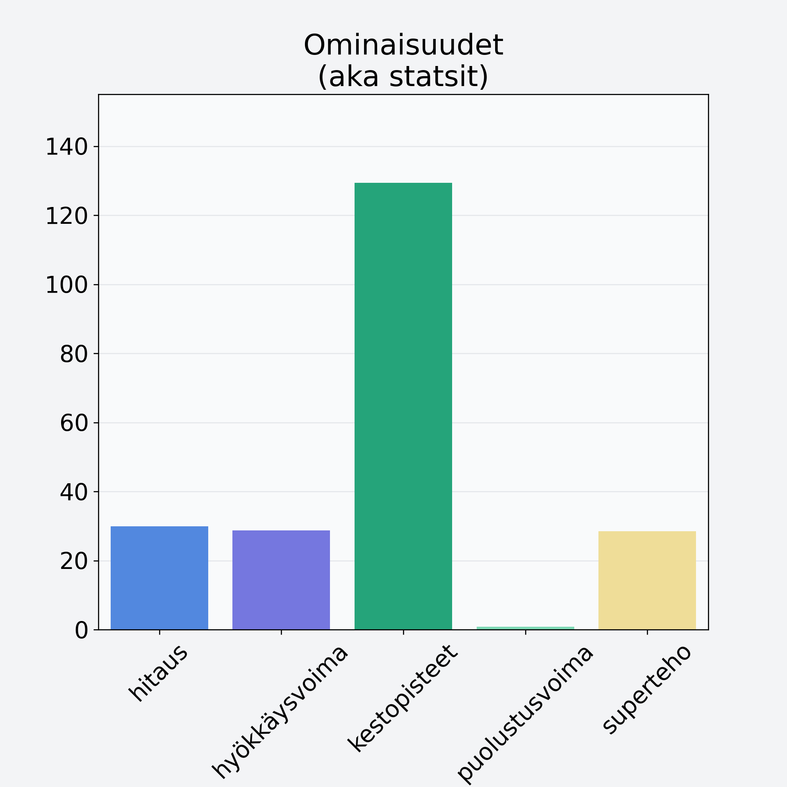

# Sorbetti, vadelmasorbetti, teollinen

## Kilpailijan tiedot { data-search-exclude }

:octicons-shield-check-24:{ .shieldMarker } Kilpailija on Finelin hyväksymä.

{ loading=lazy }

## Lisätiedot { data-search-exclude }
=== "Statsit numeerisena"

     | Voima          |   Arvo |
     |:---------------|-------:|
     | hitaus         |  29.86 |
     | hyökkäysvoima  |  28.7  |
     | kestopisteet   | 129.36 |
     | puolustusvoima |   0.8  |
     | superteho      |  28.5  |

=== "Samankaltaisia kilpailijoita"
    [Mansikka](/mansikka){ .md-button .md-button--primary .similarProduct }
    [Marja-aronia](/marja-aronia){ .md-button .md-button--primary .similarProduct }
    [Pihlajanmarja](/pihlajanmarja){ .md-button .md-button--primary .similarProduct }

!!! info inline start "Huomio"

    Hyökkäysvoima vaihtelee eri sotureilla :)
