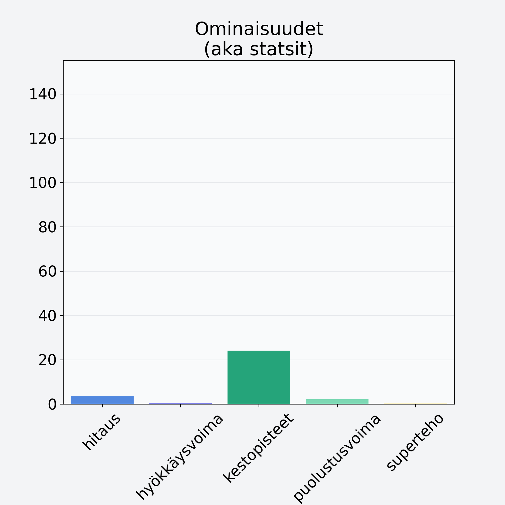

# Suppilovahvero

## Kilpailijan tiedot { data-search-exclude }

:octicons-shield-check-24:{ .shieldMarker } Kilpailija on Finelin hyväksymä.

{ loading=lazy }

## Lisätiedot { data-search-exclude }
=== "Statsit numeerisena"

     | Voima          |   Arvo |
     |:---------------|-------:|
     | hitaus         |   3.43 |
     | hyökkäysvoima  |   0.42 |
     | kestopisteet   |  24.12 |
     | puolustusvoima |   2.17 |
     | superteho      |   0.25 |

=== "Samankaltaisia kilpailijoita"
    [Karvarousku](/karvarousku){ .md-button .md-button--primary .similarProduct }
    [Kantarelli](/kantarelli){ .md-button .md-button--primary .similarProduct }
    [Männynherkkutatti, pakaste](/mannynherkkutatti-pakaste){ .md-button .md-button--primary .similarProduct }
    [Herkkutatti](/herkkutatti){ .md-button .md-button--primary .similarProduct }
    [Herkkusieni](/herkkusieni){ .md-button .md-button--primary .similarProduct }
    [Quorn, fileet, kuutiot, rouhe](/quorn-fileet-kuutiot-rouhe){ .md-button .md-button--primary .similarProduct }

!!! info inline start "Huomio"

    Hyökkäysvoima vaihtelee eri sotureilla :)
