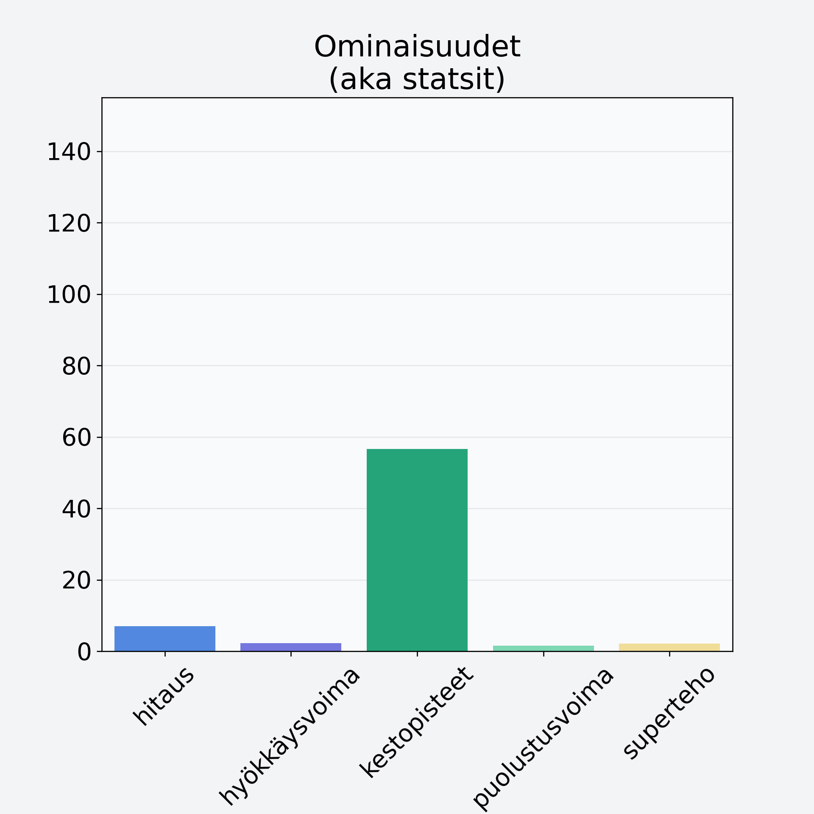

# Tyrnimarja

## Kilpailijan tiedot { data-search-exclude }

:octicons-shield-check-24:{ .shieldMarker } Kilpailija on Finelin hyväksymä.

{ loading=lazy }

## Lisätiedot { data-search-exclude }
=== "Statsit numeerisena"

     | Voima          |   Arvo |
     |:---------------|-------:|
     | hitaus         |   6.96 |
     | hyökkäysvoima  |   2.24 |
     | kestopisteet   |  56.61 |
     | puolustusvoima |   1.5  |
     | superteho      |   2.09 |

=== "Samankaltaisia kilpailijoita"
    [Lakka, suomuurain, hilla](/lakka-suomuurain-hilla){ .md-button .md-button--primary .similarProduct }
    [Mustikka, kuivattu, mustikkajauhe](/mustikka-kuivattu-mustikkajauhe){ .md-button .md-button--primary .similarProduct }
    [Karpalo, kuivattu, karpalojauhe](/karpalo-kuivattu-karpalojauhe){ .md-button .md-button--primary .similarProduct }
    [Karpalo](/karpalo){ .md-button .md-button--primary .similarProduct }
    [Marja, keskiarvo](/marja-keskiarvo){ .md-button .md-button--primary .similarProduct }
    [Ruusunmarja, kuivattu, ruusunmarjajauhe](/ruusunmarja-kuivattu-ruusunmarjajauhe){ .md-button .md-button--primary .similarProduct }

!!! info inline start "Huomio"

    Hyökkäysvoima vaihtelee eri sotureilla :)
