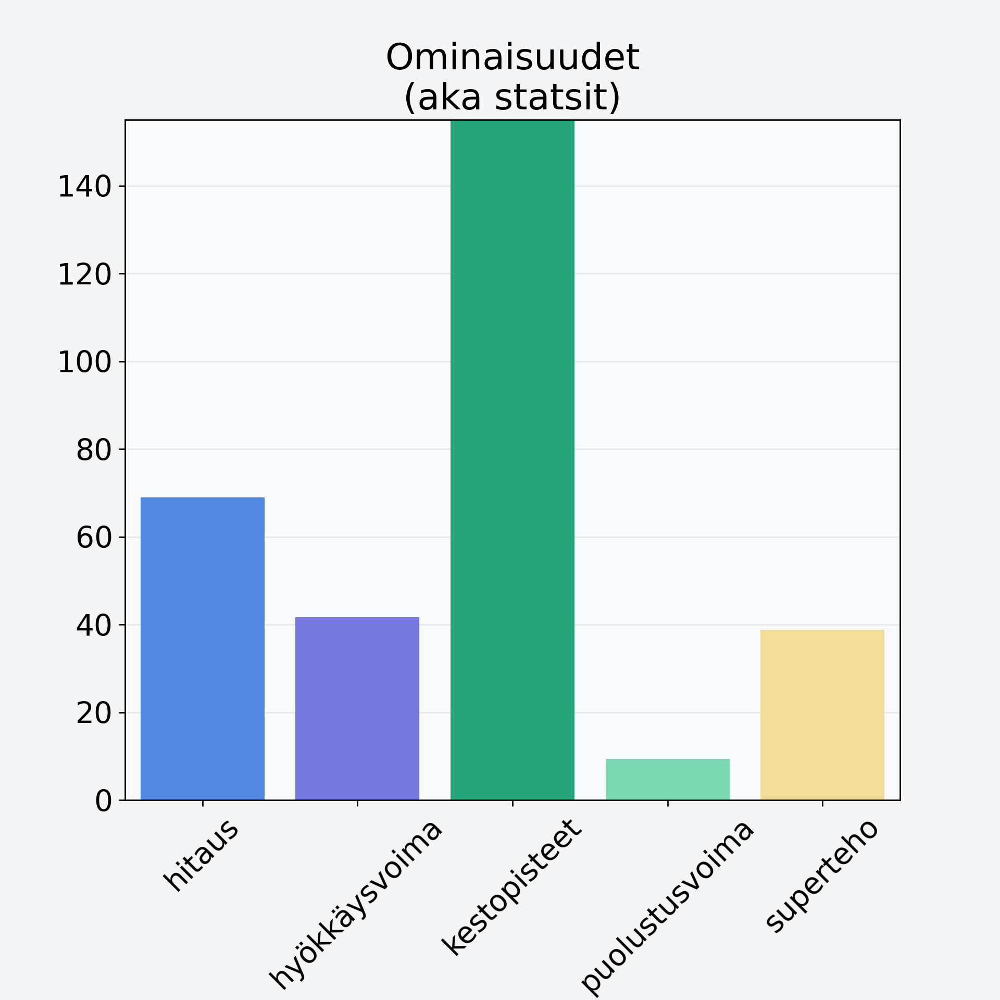

# Välipalapatukka, raakapatukka, bare bar, viljaton

## Kilpailijan tiedot { data-search-exclude }

:octicons-shield-check-24:{ .shieldMarker } Kilpailija on Finelin hyväksymä.

{ loading=lazy }

## Lisätiedot { data-search-exclude }
=== "Statsit numeerisena"

     | Voima          |   Arvo |
     |:---------------|-------:|
     | hitaus         |  69.03 |
     | hyökkäysvoima  |  41.7  |
     | kestopisteet   | 393.12 |
     | puolustusvoima |   9.41 |
     | superteho      |  38.85 |

=== "Samankaltaisia kilpailijoita"
    [Oliivi, keskiarvo, punnittu kivineen, öljyssä, vihreä/musta](/oliivi-keskiarvo-punnittu-kivineen-oljyssa-vihrea-musta){ .md-button .md-button--primary .similarProduct }
    [Passionhedelmä](/passionhedelma){ .md-button .md-button--primary .similarProduct }
    [Granaattiomena, kuorittu](/granaattiomena-kuorittu){ .md-button .md-button--primary .similarProduct }
    [Ananas, tuore, punnittu kuorineen](/ananas-tuore-punnittu-kuorineen){ .md-button .md-button--primary .similarProduct }
    [Jogurttirusina/jogurttihedelmä, kuorrutettu kuivattu hedelmä](/jogurttirusina-jogurttihedelma-kuorrutettu-kuivattu-hedelma){ .md-button .md-button--primary .similarProduct }
    [Viikuna, kuivattu](/viikuna-kuivattu){ .md-button .md-button--primary .similarProduct }

!!! info inline start "Huomio"

    Hyökkäysvoima vaihtelee eri sotureilla :)
