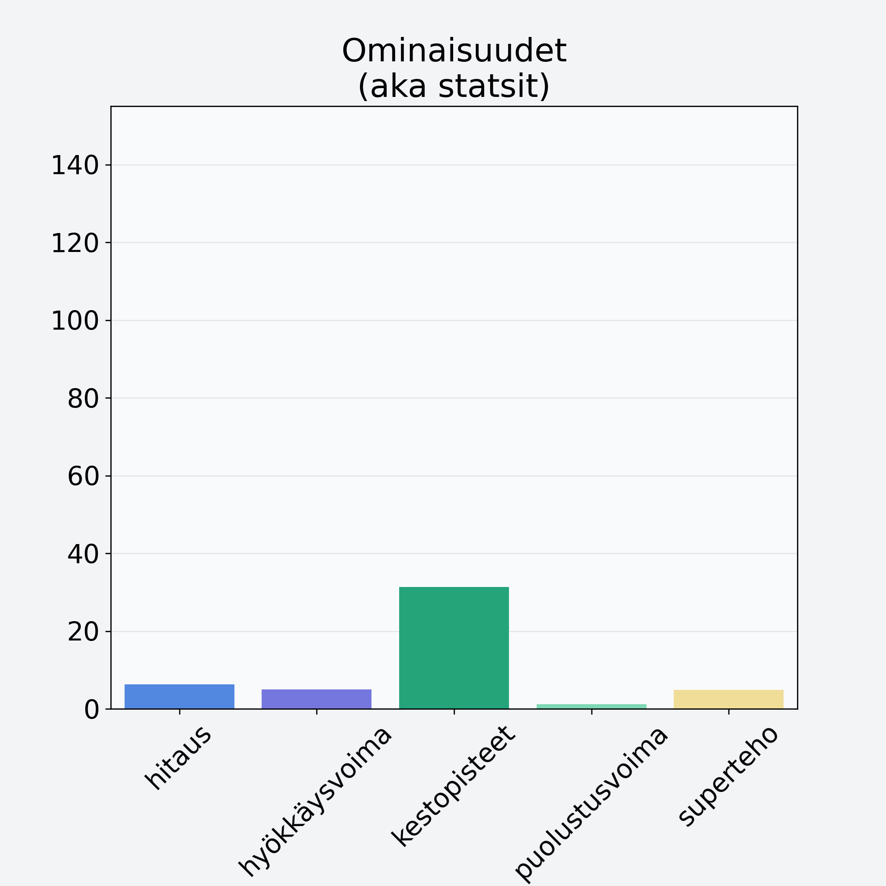

# Valkokaali, keräkaali

## Kilpailijan tiedot { data-search-exclude }

:octicons-shield-check-24:{ .shieldMarker } Kilpailija on Finelin hyväksymä.

{ loading=lazy }

## Lisätiedot { data-search-exclude }
=== "Statsit numeerisena"

     | Voima          |   Arvo |
     |:---------------|-------:|
     | hitaus         |   6.27 |
     | hyökkäysvoima  |   4.97 |
     | kestopisteet   |  31.39 |
     | puolustusvoima |   1.2  |
     | superteho      |   4.82 |

=== "Samankaltaisia kilpailijoita"
    [Kiinankaali](/kiinankaali){ .md-button .md-button--primary .similarProduct }
    [Valkokaali, keräkaali](/valkokaali-kerakaali){ .md-button .md-button--primary .similarProduct }

!!! info inline start "Huomio"

    Hyökkäysvoima vaihtelee eri sotureilla :)
