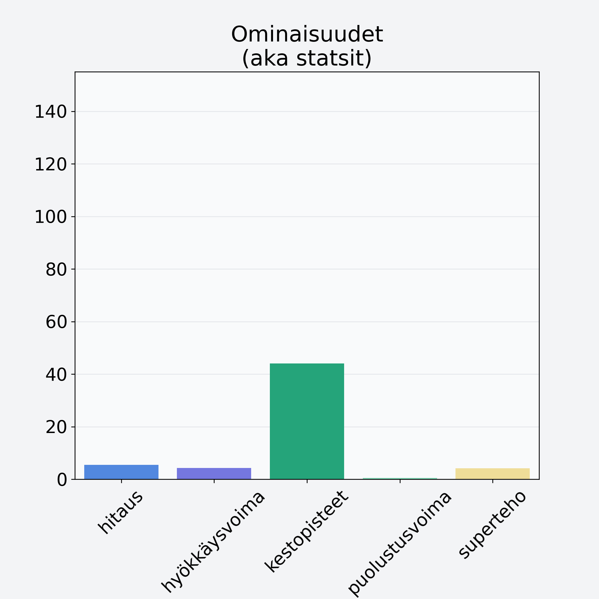

# Variksenmarja

## Kilpailijan tiedot { data-search-exclude }

:octicons-shield-check-24:{ .shieldMarker } Kilpailija on Finelin hyväksymä.

{ loading=lazy }

## Lisätiedot { data-search-exclude }
=== "Statsit numeerisena"

     | Voima          |   Arvo |
     |:---------------|-------:|
     | hitaus         |   5.49 |
     | hyökkäysvoima  |   4.25 |
     | kestopisteet   |  44.01 |
     | puolustusvoima |   0.5  |
     | superteho      |   4.1  |

=== "Samankaltaisia kilpailijoita"
    [Lakka, suomuurain, hilla](/lakka-suomuurain-hilla){ .md-button .md-button--primary .similarProduct }
    [Puolukka](/puolukka){ .md-button .md-button--primary .similarProduct }
    [Juolukka](/juolukka){ .md-button .md-button--primary .similarProduct }
    [Mustikka, kuivattu, mustikkajauhe](/mustikka-kuivattu-mustikkajauhe){ .md-button .md-button--primary .similarProduct }
    [Katajanmarja](/katajanmarja){ .md-button .md-button--primary .similarProduct }

!!! info inline start "Huomio"

    Hyökkäysvoima vaihtelee eri sotureilla :)
