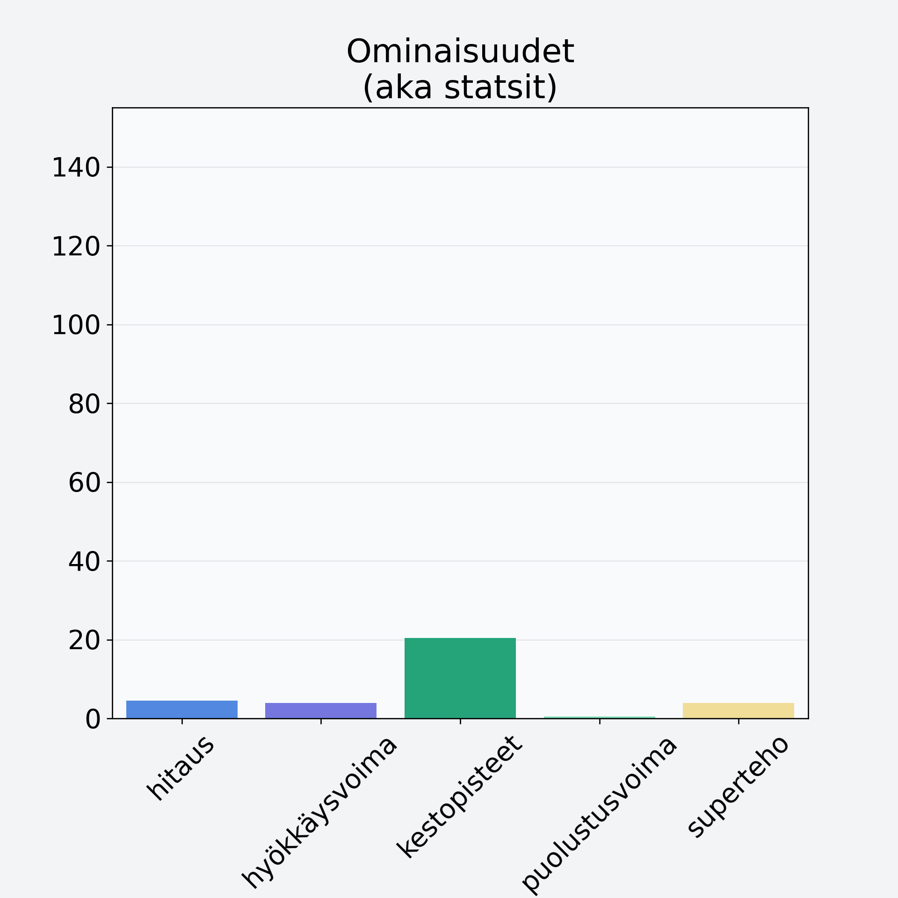

# Vesimeloni, punnittu kuorineen

## Kilpailijan tiedot { data-search-exclude }

:octicons-shield-check-24:{ .shieldMarker } Kilpailija on Finelin hyväksymä.

{ loading=lazy }

## Lisätiedot { data-search-exclude }
=== "Statsit numeerisena"

     | Voima          |   Arvo |
     |:---------------|-------:|
     | hitaus         |   4.48 |
     | hyökkäysvoima  |   3.9  |
     | kestopisteet   |  20.47 |
     | puolustusvoima |   0.5  |
     | superteho      |   3.9  |

=== "Samankaltaisia kilpailijoita"
    [Rusina](/rusina){ .md-button .md-button--primary .similarProduct }
    [Sekahedelmä, kuivattu](/sekahedelma-kuivattu){ .md-button .md-button--primary .similarProduct }
    [Banaani, kuorittu](/banaani-kuorittu){ .md-button .md-button--primary .similarProduct }
    [Kiivi, punnittu kuorineen](/kiivi-punnittu-kuorineen){ .md-button .md-button--primary .similarProduct }
    [Kiivi, kuorittu](/kiivi-kuorittu){ .md-button .md-button--primary .similarProduct }
    [Erikoishedelmä, eksoottinen, keskiarvo, mango/papaija, kuivattu](/erikoishedelma-eksoottinen-keskiarvo-mango-papaija-kuivattu){ .md-button .md-button--primary .similarProduct }

!!! info inline start "Huomio"

    Hyökkäysvoima vaihtelee eri sotureilla :)
